<h1>La Biblia de Altium 🧾</h1>

- [Comandos para el Esquemático](#comandos-para-el-esquemático)
  - [Formato de la hoja de Esquemático](#formato-de-la-hoja-de-esquemático)
  - [Comando Place](#comando-place)
    - [Place Part](#place-part)
    - [Place Wire](#place-wire)
    - [Place Net Label](#place-net-label)
  - [Comando Align](#comando-align)
    - [Distribuir](#distribuir)
    - [Align Vertical/Horizontal centers](#align-verticalhorizontal-centers)
  - [Designators](#designators)
  - [Reset Designators](#reset-designators)
  - [SCH List y cambio de Footprints](#sch-list-y-cambio-de-footprints)
  - [Update to Schematic](#update-to-schematic)
  - [Cross Select mode.](#cross-select-mode)
- [Comandos para el Pcb](#comandos-para-el-pcb)
  - [Modificación de Grid](#modificación-de-grid)
  - [Grid Customizada](#grid-customizada)
    - [Steps](#steps)
    - [Display](#display)
  - [Rules](#rules)
    - [Width Routing](#width-routing)
    - [Clearance](#clearance)
      - [Separación del polígono:](#separación-del-polígono)
  - [Place](#place)
  - [Cambio de capa](#cambio-de-capa)
  - [Tipos de pista](#tipos-de-pista)
  - [Cambio de ancho de pista](#cambio-de-ancho-de-pista)
  - [Align (pero en PCB)](#align-pero-en-pcb)
    - [Distribuir](#distribuir-1)
    - [Align Vertical/Horizontal centers](#align-verticalhorizontal-centers-1)
  - [Resaltar Capas](#resaltar-capas)
  - [Resaltar pistas o conexiones](#resaltar-pistas-o-conexiones)
    - [Aumentar o disminuir el contraste](#aumentar-o-disminuir-el-contraste)
  - [Keepout](#keepout)
  - [Re-definir el espacio de trabajo.](#re-definir-el-espacio-de-trabajo)
  - [Modificación de footprint](#modificación-de-footprint)
  - [Repour polygon](#repour-polygon)
- [Archivos de Impresión](#archivos-de-impresión)
  - [PDF de Impresión](#pdf-de-impresión)

# Comandos para el Esquemático

## Formato de la hoja de Esquemático

En altium se puede cambiar el formato de la hoja del esquemático. En el menú de la derecha en las pestañas inferiores estará la pestaña de "Properties"

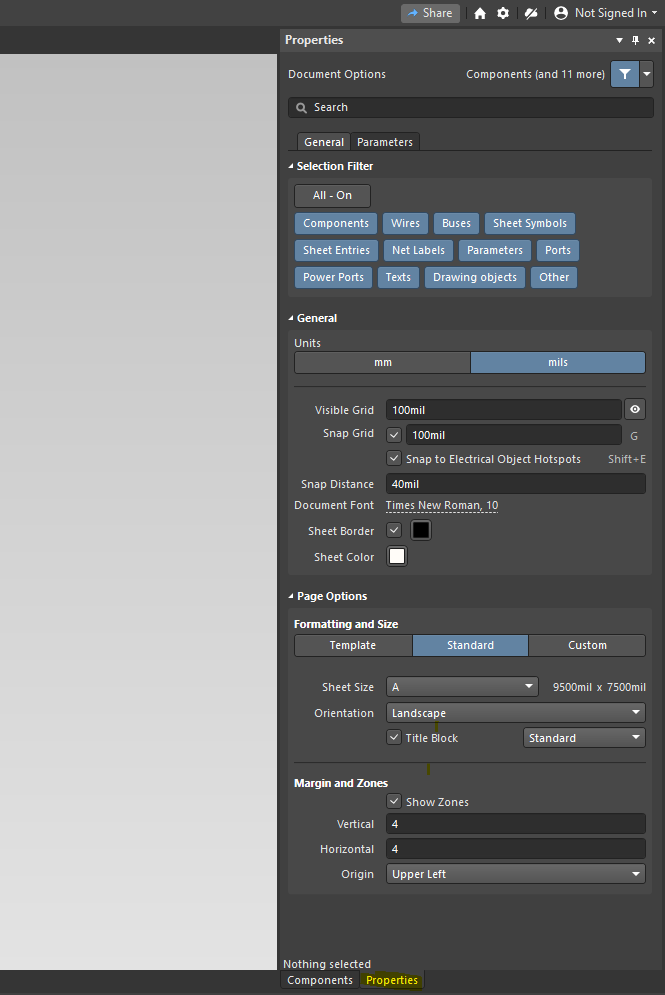

Ahora nos aparecerá el menú de la imagen de arriba en donde podremos cambiar el tamaño de la grilla, el de la hoja, etc...

## Comando Place

Para poder agregar cualquier elemento a nuestro esquemático Altium nos ofrece una barra de opciones para colocar la gran mayoría de elementos. 

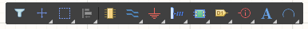

Sin embargo muchas veces resulta mucho más rápido usar el atajo "place". Al apretar la tecla <kbd>p</kbd> nos abrirá una lista de opciones para colocar cualquier tipo de elemento sobre nuestro esquemático. Este comando por sí solo no hace nada, para poder colocar un elemento se debe presionar otra tecla (dependiendo de lo que queramos hacer).

### Place Part

Comando: <kbd>p</kbd> > <kbd>p</kbd>

Esto nos abrirá el menú para colocar componentes.

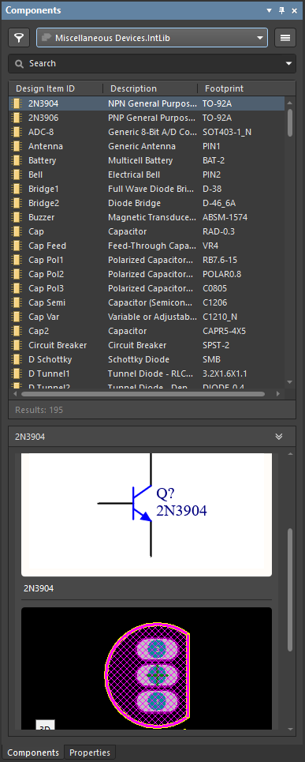

### Place Wire

Comando: <kbd>p</kbd> > <kbd>w</kbd>

Este comando se usa para colocar conexiones.

### Place Net Label

Comando: <kbd>p</kbd> > <kbd>n</kbd>

Este comando se usa para colocar Net Labels, son parecidas en funcionamiento a las conexiones de VCC y GND, pero podemos elegir el nombre que queramos. Se usan principalmente para asignarle un nombre a una conexión.

## Comando Align

Comando: <kbd>a</kbd> > <kbd>t</kbd> / <kbd>b</kbd> / <kbd>l</kbd> / <kbd>r</kbd>

Para poder alinear componentes y que nuestro esquemático quede mucho más elegante, podemos usar el comando "align". Para poder usarlo debemos primero seleccionar los componentes, para ello podemos seleccionarlos con el mouse o usando la tecla <kbd>Shift</kbd> y **luego** usamos el comando

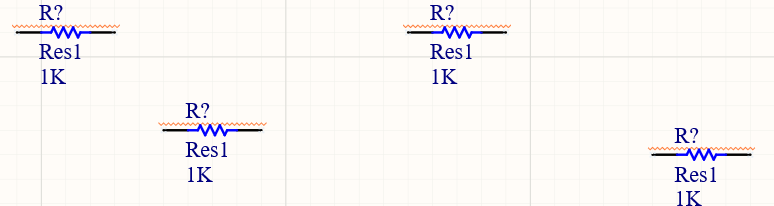

Después

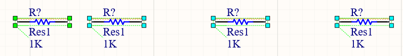

### Distribuir

Comando Horizontal: <kbd>Ctrl</kbd> + <kbd>Shift</kbd> + <kbd>h</kbd>

Comando Vertical: <kbd>Ctrl</kbd> + <kbd>Shift</kbd> + <kbd>v</kbd>

Dentro del comando align está la posibilidad de separar los componentes de manera equidistante de manera horizontal o vertical.

Después

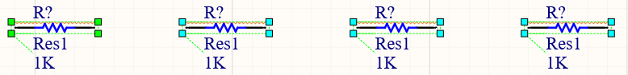

### Align Vertical/Horizontal centers

Comando eje vertical: <kbd>a</kbd> > <kbd>v</kbd>

Comando eje horizontal: <kbd>a</kbd> > <kbd>c</kbd>

Si por algún motivo quisiéramos alinear componentes respecto a su centro, con las herramientas vistas anteriormente no podríamos, porque los alineará a la izquierda, derecha, arriba ..... etc, pero no quedarán centrados.

Para ello están estos comandos, uno los alinea por el eje vertical y otro por el eje horizontal.

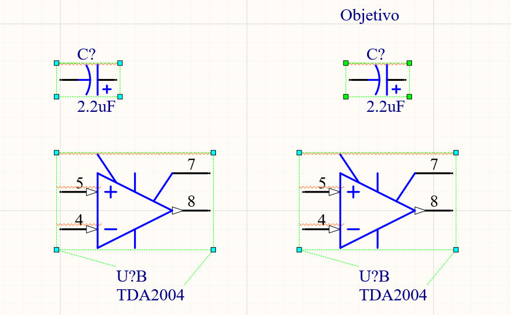

## Designators

Comando: <kbd>t</kbd> > <kbd>a</kbd> > <kbd>u</kbd>

Para poder cambiar todos los designators de manera rápida y sencilla se puede utilizar este comando. Este comando le asignará un número a cada designator de los componentes. 

Este comando sólo afectará a aquellos designators que tengan un signo de pregunta "?"

## Reset Designators

Comando: <kbd>t</kbd> > <kbd>a</kbd> > <kbd>e</kbd>

Resetea todos los designators, convierte todos los designadores numerados por signos de pregunta "?".

Este comando se usa para resetear todos los designators, esto puede llegar a ser útil en la etapa de diseño del esquemático cuando copiemos y peguemos partes de un circuito que ya tenga deisgnators y estos al copiarlos queden repetidos (lo que nos traiga problemas).

## SCH List y cambio de Footprints

Cuando queremos modificar la footprint de varios componentes similares, en vez de modificar uno por uno las propiedades del componente, existe el menú de "SCH List".

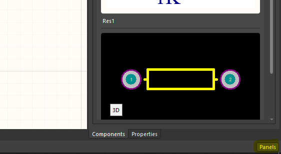

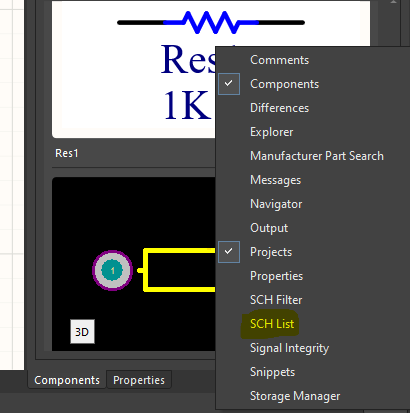

Al abrirlo nos mostrará esta ventana.

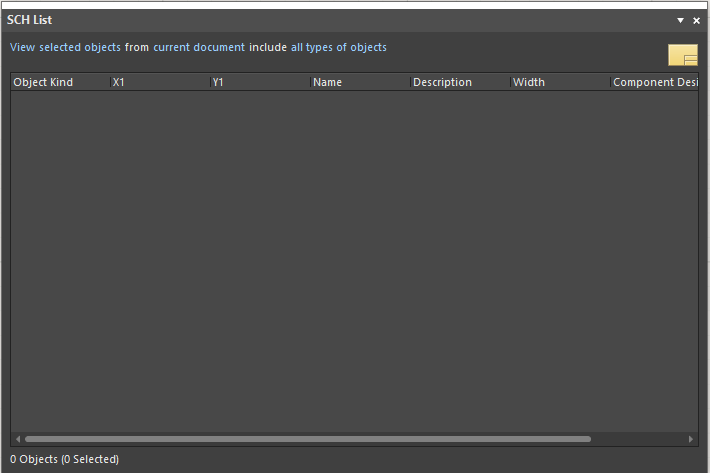

Para poder modificar la footprint de algunos componentes primero debemos verificar que en esta ventana arriba a la izquierda diga "selcted objects", esto hara que solo muestre la lista de componentes de aquellos que hayamos seleccionado.

Tengan cuidado que altium solo mostrará las propiedades que tengan en común, si seleccionamos componentes y cables, no podremos visualizar la columna footprints, porque un cable no tiene una footprint

Ahora para modificar las footprint de los componentes, simplemente debemos deslizarnos hasta encontrar la columna de footprints.

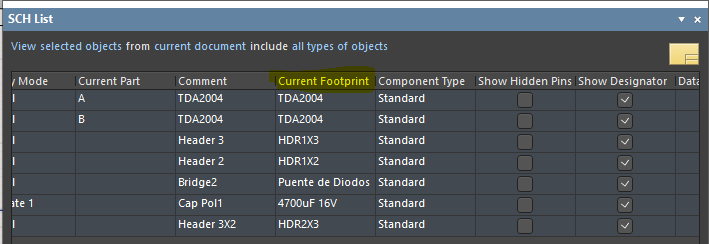

Y ya podremos modificar cada footprint individualmente.

También podemos aplicar comandos como <kbd>Ctrl</kbd> + <kbd>c</kbd> o <kbd>Ctrl</kbd> + <kbd>v</kbd> cuando queremos usar la misma footprint en varios componentes.

Si por algún motivo no nos deja copiar y pegar valores puede ser que tengamos que ejecutar el siguiente comando: hacer *click derecho* y luego *switch to edit mode*.

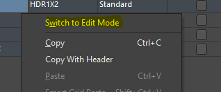

## Update to Schematic

Comando: <kbd>d</kbd> > <kbd>u</kbd>

Cuando ya tenemos listo nuestro hermoso esquemático, debemos actualizar los cambios al archivo de Pcb, para ello utilizaremos este comando.

También sirve para actualizar algún cambio que hayamos hecho.

## Cross Select mode.

Comando: <kbd>Ctrl</kbd> + <kbd>Shift</kbd> + <kbd>x</kbd>

Para poder encontrar tanto en el esquemático como en el pcb hay una opción que lo que hace es que los componentes que seleccionemos en el esquemático, también se seleccionen en el pcb, y viceversa. Esta herramienta se llama "Cross Select mode", se puede activar con este comando o desde la pestaña de tools.

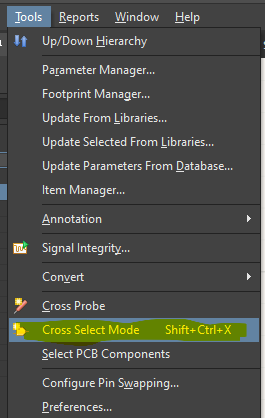

# Comandos para el Pcb

## Modificación de Grid

Comando: <kbd>g</kbd>

Como ya sabrán altium usa una "grilla" para colocar los componentes, cuando movemos un elemento este buscará alinearse con esta grilla. Pero... ¿Qué pasa cuando queremos posicionar un objeto en un lugar que no nos permite la grilla?

Bueno como primera medida se puede usar el comando <kbd>g</kbd> que nos abre un menú de las distintas medidas **estándar** para la grilla. En este caso sería cuestión de elegir una medida más pequeña.

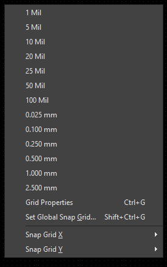

Grid Grande:

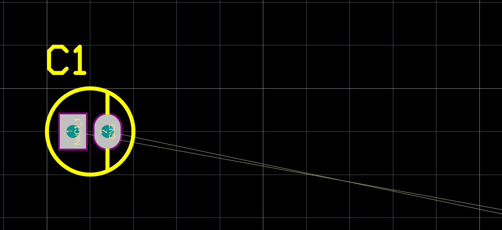

Grid Chica:

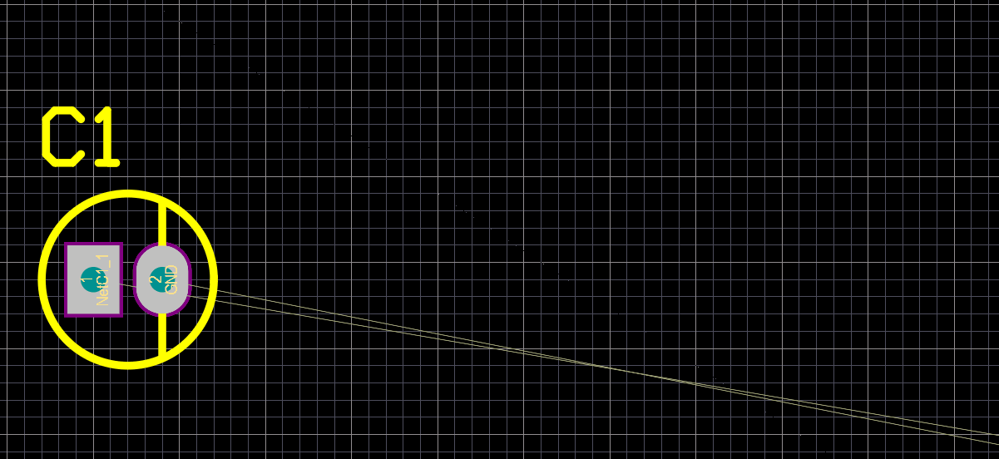

## Grid Customizada

Comando: <kbd>Ctrl</kbd> + <kbd>g</kbd>

Puede suceder que el comando de arriba no sea suficiente para nuestras necesidades, sobre todo cuando estamos diseñando una Footprint que en algunos casos no usa una medida estándar. Para ello existe este comando.

Cuando lo ejecutemos nos abrira esta ventana:

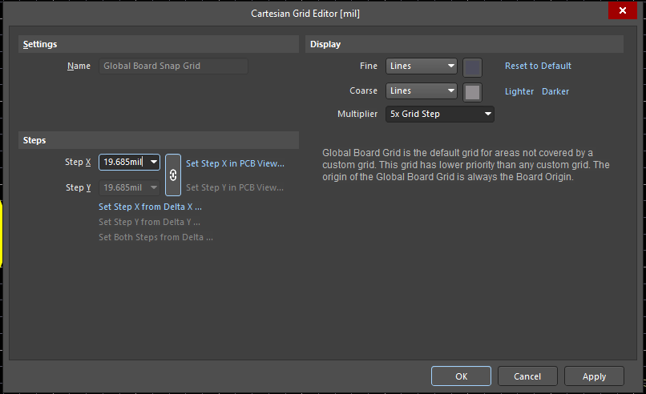

### Steps

En la sección de "Steps" nos permite modificar los steps en "x" **pero no** en "y", esto es porque por defecto altium nos ofrece la opción de hacer grillas cuadradas (misma medida en "x" que en "y"). Pero podemos cambiar esto, para ello tenemos que apretar el botón con la cadenita, y esto va a desvincular la medida en "x" de la de "y", y podremos colocar distintas medidas.

### Display

Cuando creamos un pcb por primera vez Altium no ofrece una cálida bienvenida con una maraña de líneas, que puede llegar a resultar molesto. Pero también podemos modificar esto, en la misma ventana de propiedades de la grilla, en la sección de "Display" tenemos dos tipos de líneas, la línea Fine y la línea Coarse, aquí podremos cambiar el tipo de línea (y el color también). El que yo recomiendo usar es el tipo de línea "Dots", de esta forma la vista del pcb será mucho más agradable.

## Rules

Comando: <kbd>d</kbd> > <kbd>r</kbd>

Para poder modificar los parámetros estándar y las reglas que guiarán el diseño de nuestro pcb debemos abrir el menú de las reglas.

### Width Routing

Lo primero será modificar el ancho mínimo preferido y máximo de las pistas, para eso nos vamos a la siguiente dirección: "Routing > Width > Width".

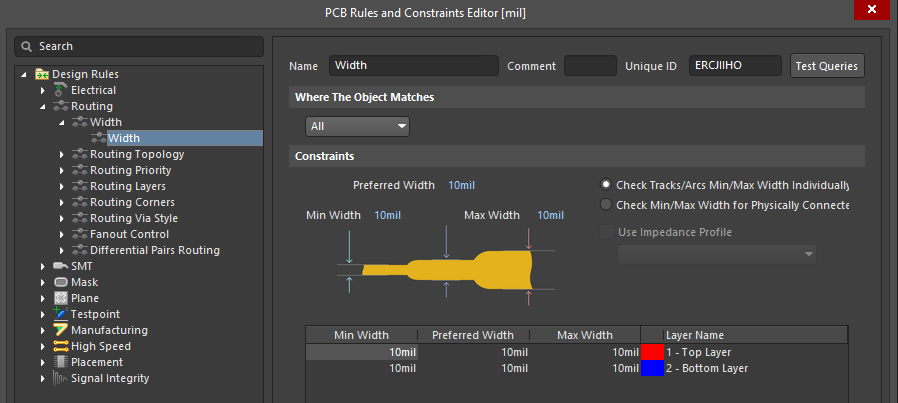

Ahí simplemente modificaremos las medidas que queramos.

### Clearance

Para modificar la separación entre componentes nos iremos a "Electrical > Clearance > Clearance". 

Esta Clearance aplica a todo tipo de elementos, ya sea pistas, componentes polígonos, etc.. 

#### Separación del polígono:

Si nosotros deseamos solamente modificar la separación del polígono respecto a las pistas debemos crear una nueva regla. Para esto hacemos click derecho en la regla clearance y luego en "duplicate rule".

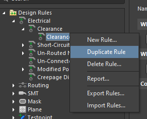

La regla deberá tener las siguientes características:

1. En nombre de la Rule debería ser representativo (en general uso pol "Polygon")
2. En la sección de "Where the first object matches" elegimos la opción "Custom Query"
    1. Esto nos abrirá una casilla de texto en la que debemos escribir **textualmente** "InPolygon".
3. En la sección de "Constrains" 
    1. Escribimos la medida de la separación del polígono.
    2. Tildamos la casilla "Ignore pad to pad clearances within a footprint"
4. Por último debemos modificar la prioridad de esta nueva regla.
    1. Para ello apretamos el botón de abajo a la izquierda que dice "Priorities".
    2. Seleccionamos nuestra regla del polígono y apretamos el botón de increase priority.

Así deberá verse nuestra nueva regla:

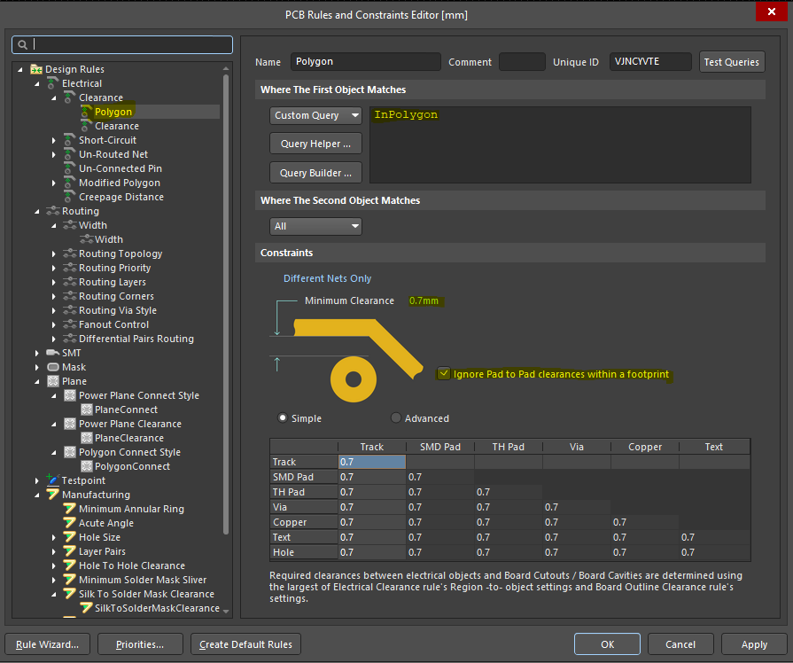

Así deben verse las prioridades de las reglas:

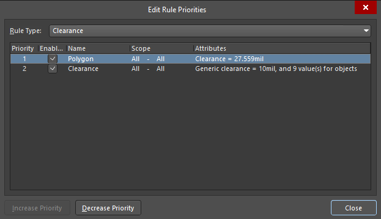

## Place

Al igual que en el esquemático en el pcb tenemos una barra para colocar distintos elementos de un pcb

También tenemos el comando place, para ello presionamos <kbd>p</kbd> y luego la letra que corresponda con el elemento que queramos colocar.

Por ejemplo, para colocar una pista presionamos <kbd>p</kbd> > <kbd>t</kbd> (de "track", pista en inglés).

## Cambio de capa

Si quisiéramos cambiar de capa podemos hacerlo apretando <kbd>Ctrl</kbd> + <kbd>Shift</kbd> y movemos la rueda del mouse.

Algo interesante de este comando es que, si estamos colocando una pista y en el momento cambiamos de pista, automáticamente nos coloca una vía:

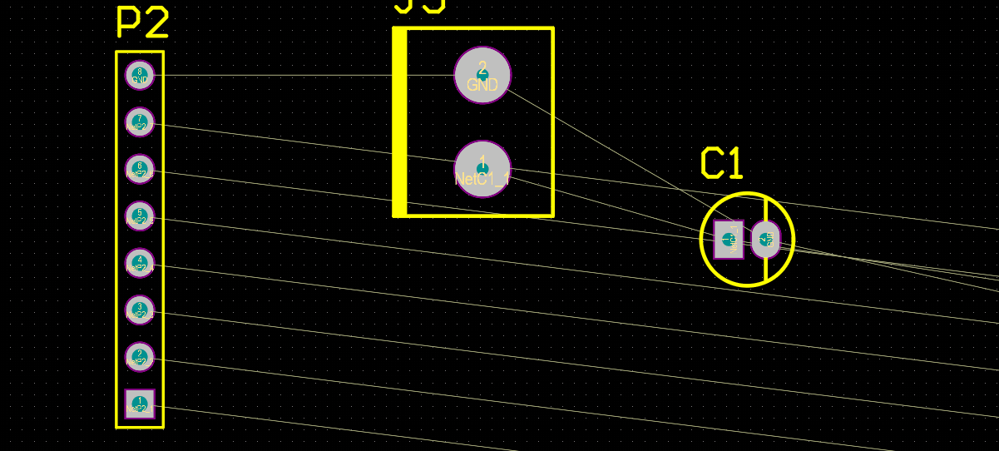

## Tipos de pista

Comando: <kbd>Shift</kbd> + <kbd>espacio</kbd>

Cuando colocamos una pista podemos elegir para que haga giros de 45º 90º, "curvas" de 45º y 90º, o simplemente en cualquier dirección.

Para esto **mientras** estamos colocando una pista, presionamos <kbd>Shift</kbd> + <kbd>espacio</kbd>

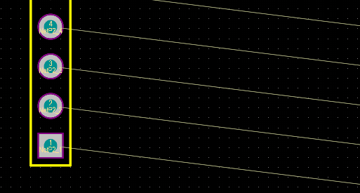

## Cambio de ancho de pista

Comando: <kbd>3</kbd>

Para cambiar el ancho de pista podemos presionar la tecla <kbd>3</kbd> **mientras** estamos colocando una pista.

## Align (pero en PCB)

Comando: <kbd>a</kbd> > <kbd>t</kbd> / <kbd>b</kbd> / <kbd>l</kbd> / <kbd>r</kbd>

En el esquemático habíamos visto que existe la posibilidad de alinear componentes, bueno... en el pcb también.

### Distribuir

Comando Horizontal: <kbd>Ctrl</kbd> + <kbd>Shift</kbd> + <kbd>h</kbd>

Comando Vertical: <kbd>Ctrl</kbd> + <kbd>Shift</kbd> + <kbd>v</kbd>

En el esquemático habíamos visto que existe la posibilidad de distribuir equitativamente los componentes, bueno... en el pcb también.

Este comando no funciona bien cuando los componentes tienen distinto tamaño.

### Align Vertical/Horizontal centers

Comando eje vertical: <kbd>a</kbd> > <kbd>v</kbd>

Comando eje horizontal: <kbd>a</kbd> > <kbd>c</kbd>

En el esquemático habíamos visto que podemos alinear componentes respecto a su centro, bueno... en el pcb también. Peeeero, ahora el cursor tendrá una cruz debemos seleccionan respecto *a qué componente* queremos alinear el resto de seleccionados.

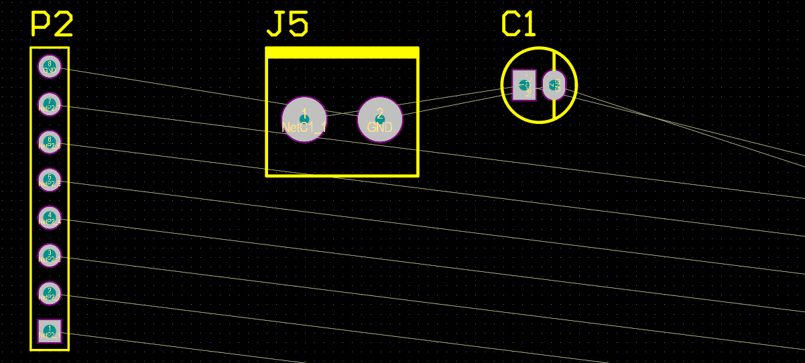

## Resaltar Capas

Comando: <kbd>Shift</kbd> + <kbd>s</kbd>

Para poder obtener una mejor visualización de la capa en la que estamos trabajando podemos usar este comando. Esto hará que el resto de capas excepto en la que estamos trabajando, quedaran de color gris. Si volvemos a usar este comando directamente desaparecen.

## Resaltar pistas o conexiones

Comando: <kbd>Ctrl</kbd> + Click Izquierdo

Para resaltar una pista o conexión hacemos "<kbd>Ctrl</kbd> + Click Izquierdo" sobre la pista o isla que queramos resaltar.

Para dejar de resaltar conexiones, simplemente presionan "<kbd>Ctrl</kbd> + Click Izquierdo" sobre un espacio negro.

### Aumentar o disminuir el contraste

Para una mejor visualización de las pistas resaltadas podemos aumentar o disminuir el contraste podemos presionar <kbd>[</kbd> o <kbd>]</kbd>

Esto solo funciona solamente presionando **directamente** la tecla del corchete, es decir, no funcionará si tenemos que presionar <kbd>AltGr</kbd> u otra combinación de teclas para acceder al corchete. 

La solución para este problema es descargando el idioma para el teclado americano (porque tiene una tecla dedicada a los corchetes). Para cambiar de idiomas en windows se presiona <kbd>Windows</kbd> + <kbd>espacio</kbd>.

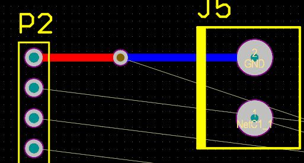

## Keepout

Comando: <kbd>p</kbd> > <kbd>k</kbd> > <kbd>t</kbd>

Una manera para definir los límites de una es usando un "keepout". Hay muchos elementos que altium nos permite usar para colocar un keepout. El que nosotros utilizaremos en esta ocasión, será el de una pista. La forma de colocación será exactamente igual que la de una pista solo que en vez de ser una pista será un keepout.

Los elementos keepout, como dice su nombre, no permiten que haya elementos cerca.

## Re-definir el espacio de trabajo.

Comando: <kbd>d</kbd> > <kbd>s</kbd> > <kbd>d</kbd>

Hay muchas maneras de redefinir el espacio de trabajo (el cuadrado negro). Una es presionando <kbd>1</kbd> esto cambiará el espacio de trabajo y solo se limitará a mostrar herramientas de trabajo relacionadas con la forma de la placa, no vamos a detallar cuál/cuáles herramientas son útiles, pero los invitamos a investigarlas.

La forma más rápida y que les recomendamos es la siguiente:

1. Primero definimos un keepout del borde de la placa.
2. Luego seleccionamos los segmentos. Una forma rápida de hacer este es seleccionando un solo segmento y luego presionan <kbd>Tab</kbd>, esto seleccionara todos los segmentos que estén en contacto al que hayamos seleccionado inicialmente.
3. Finalmente usamos el comando <kbd>d</kbd> > <kbd>s</kbd> > <kbd>d</kbd>.

## Modificación de footprint

Si bien este comando está ubicado en la categoría de "Pcb" corresponde a la categoría de pcb y esquemático.

En este caso se va a detallar como cambiar al footrpint a un componente en particular del esquemático.

1. Seleccionar el componente e ir a las propiedades del mismo.
2. En la sección "Parapeters" seleccionamos el parámetro "footprint" y hacemos click en el botón del lápiz para editar o en el boton "Add" para agregar una nueva footprint (a fines prácticos es indistinto).

    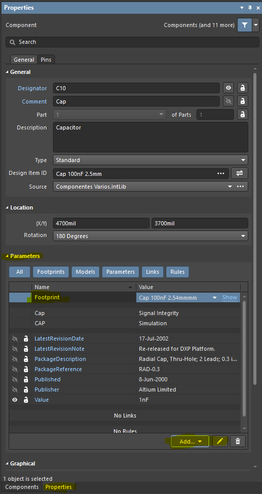

3. Luego les abrirá una ventana en la que deben buscar su footprint.

## Repour polygon

Comando: "Seleccionar polígono" > "Click derecho" > <kbd>y</kbd> > <kbd>a</kbd>

Si hacemos algunos cambios sobre nuestro diseño, el polígono no se actualiza, para ello ejecutamos este comando y automáticamente se actualizará.

# Archivos de Impresión

Estos son los pasos a seguir para generar un archivo de impresión.

Preparativos previos:

1. Ajustar el espacio de trabajo (el "cuadrado negro") al borde de la placa. Mirar [este](#re-definir-el-espacio-de-trabajo) comando. <figure>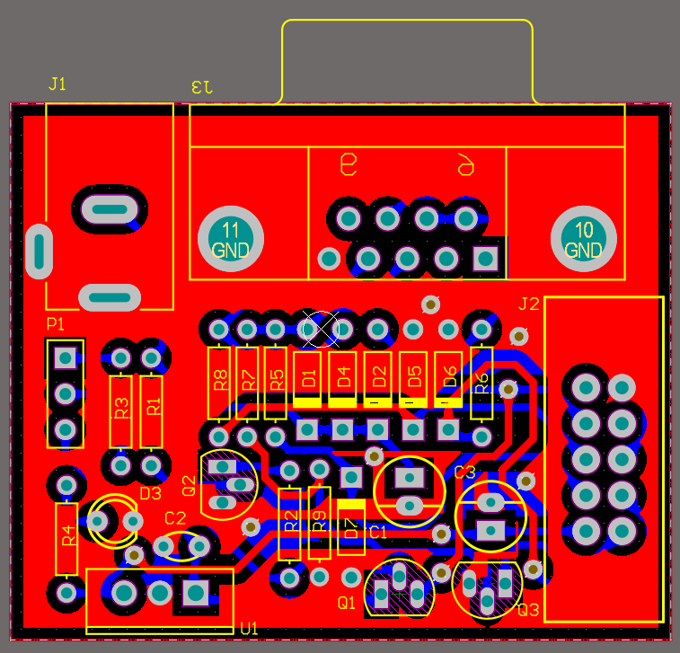<figcaption style="text-align: center;">La placa se debería ver algo así</figcaption></figure>
2. Añadir un nuevo archivo .PcbDoc provisorio al proyecto. 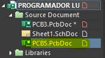
3. Colocar un "Array de Pcbs" para ello usar el comando <kbd>p</kbd> > "Embedded Board Array/Panelize"
4. Presionar la tecla <kbd>Tab</kbd> para entrar a las configuraciones, en la seccion "Pcb Document" agregar el archivo pcb de nuestro proyecto.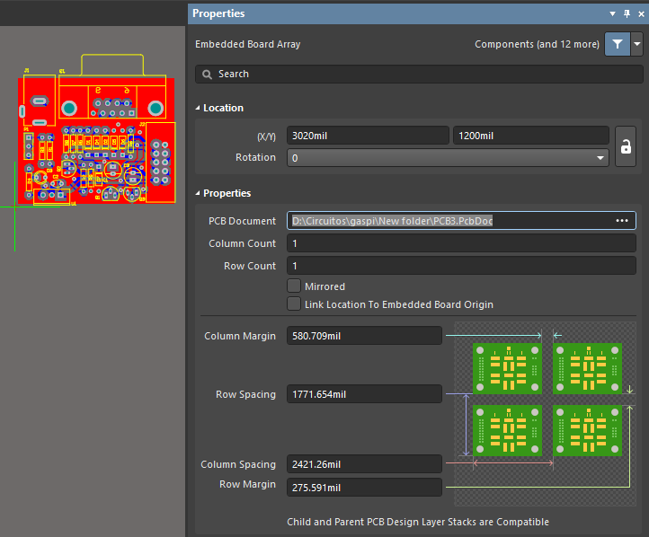
5. Elegir la cantidad de filas y columnas.
6. Definir la separación entre placa y placa en los parámetros "Row Margin" y "Column Margin" (recomiendo 5mm)
7. Finalmente colocarlo cerca de la esquina inferior del espacio de trabajo.

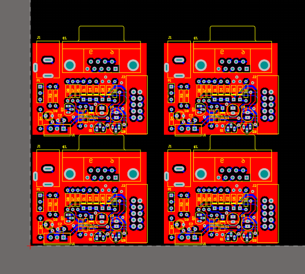

## PDF de Impresión

1. Ahora hacer Click derecho sobre el archivo nuevo y hacer click en "print preview".
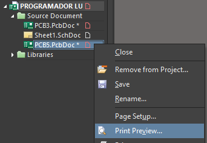
2. Click derecho sobre la hoja y hacer click en "page setup". Las opciones se deberían ver idénticas.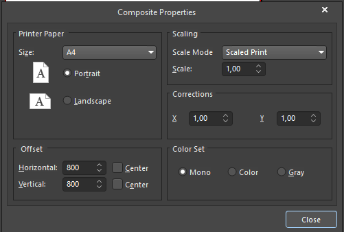
3. Cerramos la ventana, luego click derecho sobre la hoja y hacer click en "configuration". **Para bottom layer** las opciones se deberían ver idénticas a la imagen (si no aparece la capa bottom layer, entonces debemos hacer click derecho y luego "Insert Layer" y agregar la bottom layer).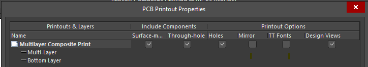
4. Hacemos click en "ok" y luego presionamos el botón de print, seleccionado la impresora que este conectada o "Microsoft Print to PDF" si deseamos generar un archivo PDF.
5. Si la placa es doble faz debemos repetir el paso 3 y 4 solo que ahora agregando la capa de Top Layer. Las opciones se deberían ver idénticas a la imagen.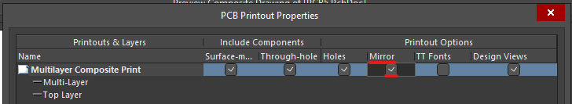

**Nótese que la casilla de "Mirror" esta tildada**
