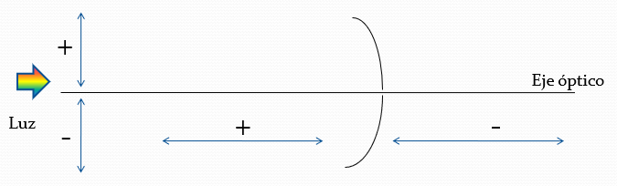

# Optica

## Triangulos Semejantes:

$$ \frac{a}{A} = \frac{b}{B} =  \frac{c}{C} $$

* Basicamente lo que dice este tema es que se mantiene la proporcion entre lados
* Esto sucede con los lados y con la altura

## Imagen Real vs Imagen Virtual

**La imagen real** aquella en donde realmente se intersectan los rayos de luz

En cambio **la imagen virtual** es la que se forma de la **proyeccion** de los rayos luminicos.

## Espejos Planos

1. El rayo incidente, el reflejado y la normal a la superficie estan todos del mimsmo plano.
2. El angulo de incidencia es igual al angulo de reflexion

* Los angulos de incidencia y refleccion se toman desde la normal al 

## Espejos Concavos y Convexos

* Concavo $\\Luz \Rarr \quad )$
* Convexo $\\Luz \Rarr \quad ($

### Formula de Descartes

$$ \frac{1}{x} + \frac{1}{x'} = \frac{1}{g} $$

* Distancia objeto: $x$
* Distancia imgaen: $x'$
* Distancia focal: $f$

$$ f = \frac{R}{2} $$

* Radio de la esfera: $R$
Z

## Convencion de Signos

## Aumento Lateral

$$ A = \frac{y'}{y} = \frac{-x'}{x} $$

## Indice de Refraccion

$$ n = \frac{c}{v_{\text{luz}}} $$

## Ley de Snell

$$ n_i \sin(\theta_i) = n_r \sin(\theta_r) $$

## Lentes 👓

* Una lente es un **sistema optico** constituido por un **medio transparente** que se encuentra **limitado** por dos **superficies** refractarias o dioptrios de las que, **al menos una**, esta curvada.

Lentes delgadas: grosor pequeño en comparacion con los radios de curvatura de las superficies refractoras y con distancias $x$ y $x'$ 

Lentes convergentes, convergen los rayos paralelos al eje optico

lentes divergentes, divergen los rayos paralelos al eje optico

Foco objeto es el punto en el que hay que colocar el objeto para que los rayos salgan paralelos

Foco imagen el punto en el que se forma la imagen para que los rayos convergan en ese puinto

Los rayos divergen como si la luz proviniese del foco imagen

## Formula del constructyor de lentes

$$ \frac{1}{x} - \frac{1}{x'} = (n-1)\cdot \left( \frac{1}{R_2} - \frac{1}{R_1} \right)  $$

$$ \frac{1}{f} = (n-1)\cdot \left( \frac{1}{R_2} - \frac{1}{R_1} \right)  $$

Por lo tanto

$$ \frac{1}{x} - \frac{1}{x'} = \frac{1}{f}  $$

Aumento 

$$ A= \frac{y'}{y} = \frac{x'}{x}$$

# Cinematica

