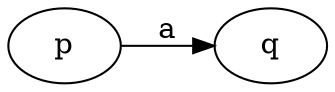
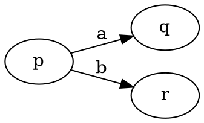
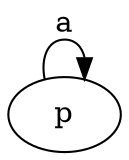
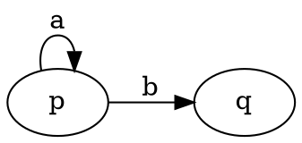
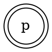

> Conjunto finito no vacio, sin elementos que se obtengan por yuxtaposicion (poner dos letras consecutivas).
> 
> Se simboliza con la letra V o con $\sum$

> * Palabra: secuencia finita de letras.
> * Palabra nula: esta formada por 0 letras se simboliza con $\lambda$.
> * Longitud: cantidad de letras que la forman.

#### Clausura de Kleene de un Alfabeto

> $V^*= V^0\cup V^1\cup V^2\cup\cdots V^n\\$
> $V^i$: conjunto de palabras de longitud $i$ formadas con las letras del alfabeto $V\\$
> Entonces $V^*$ sera el conjunto de todas las palabras, de cualquier longitud, que se puede escribir con letras del alfabeto. 

* $\lvert V^n\rvert = n\lvert V\rvert$

* $\text{long}(w_1\cdot w_2)= \text{long}(w_1)+\text{long}(w_2)$
* $w_1 \cdot (w_2\cdot w_3) = (w_1 \cdot w_2)\cdot w_3$

**Inversion o trasposicion:** es la palabra que se obtiene al escribir dicha palabra de "atras hacia adelante" se simboliza $w^R$

* $w^{R^R}=w$
* $(w_1\cdot w_2)^R=w_2^R\cdot w_1^R$
* $\lambda^R=\lambda$
* $\text{long}(w^R)= \text{long}(w)$

> Sea $w$ una palabra $\in V^*,w$ es palindromo $\iff w=w^R$

> Sea $w\in V^*$ se define:
>
> $\begin{cases}
	w^0=\lambda\\
	w^1 = w & \text{con }n\in\N_0\\
	w^n = w\cdot w^{n-1}
\end{cases}$

* $\text{long}(w^n)=n\cdot \text{long}(w)$

#### Lenguaje

> Sea $L$ un conjunto y $V$ un alfabeto. $L$ es un lenguaje $\iff L \sube V^*$

* Los lenguajes pueden ser finitos o infinitos
* Como $L\sube V^*$ entonces $L\in P(V^*)$
* $L$ al ser un conjunto se le pueden aplicar operaciones de conjuntos.
* $L$ puede no tener ningun elemento.

* $L=\{ \lambda \}= \Lambda$ se llama lenguaje nulo.
* $L=\varnothing$ se llama lenguaje vacio (no tiene palabras).

#### Concatencaion de Lenguajes

> $L = L_1\cdot L_2 = \{xy/x\in L_1 \land y\in L_2\}$

1. $\lvert L_1\cdot L_2\rvert \leq \lvert L_1\rvert \cdot \lvert L_2\rvert$
2. $(P(V^*);\bullet)$ semigrupo con neutro $L=\Lambda$
3. $L_1\cdot L_2 \neq L_2\cdot L_1$
4. $L=\varnothing$ es elemento absorbente de la concatenacion.
5. Si $L_1\sub L_2$ y $L_3\sub L_4$ entonces $L_1\cdot L_3 \sub L_2\cdot L_4$

#### Lenguaje inverso reflejo o traspuesto:

> $L^R=\{w^R/w\in L\}$, son todas las palabras del lenguaje reflejadas.

#### Potencia de un Lenguaje

> $\begin{cases}
	L^0 = \{\lambda\} \\
	L^1 = L & \text{con }n\in\N_0\\
	L^n= L\cdot L^{n-1}
\end{cases}$

#### Clausura de Kleene de un Lenguaje

> $L^*= \bigcup_{n=0}^\infin L^n= L^0\cup L^1\cup L^2\cup \cdots \cup L^n\cup \cdots$

* $\Lambda^* = \Lambda$
* $\varnothing^*=\Lambda$
* $\forall L:\lambda\in L^*$

#### Clausura Positiva de un Lenguaje

> $L^+= \bigcup_{n=1}^\infin L^n= L^1\cup L^2\cup \cdots \cup L^n\cup \cdots$

* $\Lambda^+=\lambda$
* $\varnothing^+=\varnothing$

#### Complemento de un Lenguaje

> $\overline{L}=V^*-L$

#### Gramatica

> $G=(V_n;V_t;P;S)\\$
> $V_n:$ Vocabulario o alfabeto de no terminales.$\\$
> $V_t:$ Vocabulario o alfabeto de Terminales. Letras con las que se forman las palabras.$\\$ 
> $P:$ Producciones.$\\$
> $S:$ Simbolo o variable inicial.

* $V_n$ y $V_t$ son conjuntos finitos
* $V_n \cap V_t=\varnothing$
* $P$ es finito y $P\sub (V^+-V_t^*)\times V^*$ sinedo $V=V_n\cup V_t$
* $S$ pertenece a $V_n$

* $P$ es finito y $P\sub (V^+-V_t^*)\times V^*$ sinedo $V=V_n\cup V_t$
  * $V^*$ Sin restriccion
  * $V^+ - V_t^*$ Sin restriccion

* las no terminales son las variables que generan las palabras
* terminales son las letras con las que se forman las palabras

* El lenguaje generado por la gramatica $G$ se llama $L(G)$

#### Tipos de Gramaticas (Jerarquia de Chomsky)

Tipo|Nombre|Producciones
:-:|:---:|:---
0| Irrestricta| Cualquier forma
1| Sensible al Contexto| $aXb\to aYb$ donde $\\ a,b,Y\in V^* \;X\in V_n$
2| Independiente del Contexto| $X\to Y$ donde $X\in V_n$
3| Regular | $X\to Y$ donde $X\in V_n \\ Y$ puede ser $Vt,t$ o $\lambda$ (derecha) $\\ Y$ puede ser $tV,t$ o $\lambda$ (izquierda)

* Un lenguaje se dice de tipo $K$ sii existe una gramatica detipo $k$ que la genere.
* Casi todos los lenguajes de programacion son de tipo 2
* $L_3\sube L_2\sube L_1\sube L_0$

> Un lenguaje puede estar generado por **distintas gramaticas** de **distinto tipo** para un mismo lenguaje, pero el **tipo del lenguaje** sera el de la **gramatica de mayor tipo**.

> Cada gramatica genera un unico lenguaje
> 
> Cada lenguaje puede ser generado por muhas gramaticas.

#### Expresiones Regulares

> Una ER es una secuencia de elementos que verifica:+
> 
> * $\lambda$ es ER
> * $a\in V$ entocnes $a$ es ER
> * Si $X,Y$ son ER entonces $X\cdot Y$ es ER
> * Si $X,Y$ son ER entonces $X+ Y$ es ER
> * Si $X$ es ER entonces $X^*$ es ER

#### Automatas Finitos

#### Maquinas de estados finitos

Lenguaje Tipo|Maquina que lo Reconoce
:--:|:--:
0| Mauina de Turing
1| Automata linealmente Acotado
2| Automata de Pila (Push Down)
3| Automata Finito

#### Automata Finito

> $A=(Q,V,\lambda,q_0,F)\\$
> $Q:$ Conjunto finito de estados
> $V:$ vocabulario o alfabeto de enrtada
> $\lambda:$ $Q\times V\to Q$. Funcion de transision
> $q_0:$ Estado Inicial
> $F:$ Conjunto de estados finales $F\neq \varnothing$ y  $F\sub Q$

$\,$|$x$|$y$
:--:|:-:|:-:|
$q_0$|$q_0,q_1$|$q_1$
$q_1$|$q_2$|
$q_2$||$q_1$

* la primer columna son los estados posibles del automata
* la primer fila son las letras del alfabeto
* lo que hay en cada celda es a que estado se dirige si se elige una letra.
* AFD: no tiene transisciones por $\lambda$, cumple con ley de unicidad. Osea, no usa el caracter $\lambda$ para alguna de las aristas, y no presenta dos posibles caminos para el mismo caracter.

  
1. $p = a\cdot q$

2. $p= a\cdot q + b\cdot r$

3. $p= a\cdot p \rArr p= a^*$

4. $p = a\cdot p + b\cdot q \rArr p= a^*\cdot(b\cdot q)$

5. $p=\lambda$

* Gramatica entonces es toda la sintaxis de $G=\{\ldots\}$ pero en los ejercicios solo va a pedir la parte de P de eso
* AF es el dibujito
* expresion regular es solo las eltras pero con asteriscos o disyunciones
* lenguaje es parecido a la expresion regular pero con clausura de letras osea $m,n,p\ldots$ 