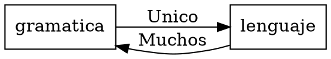
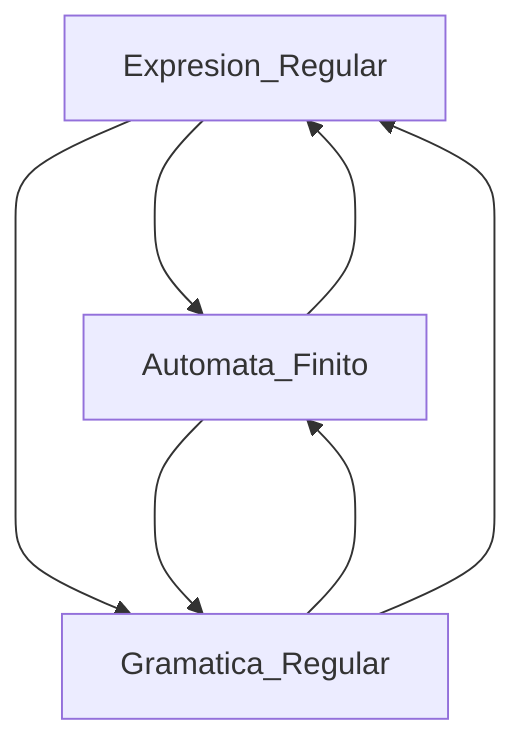
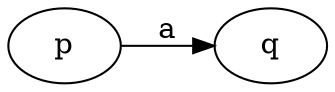
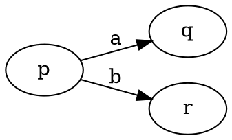
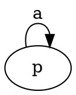
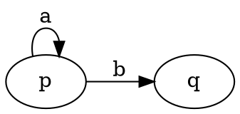

<h1><b>APUNTES MATEMATICA DISCRETA</b></h1>

- [**Unidad 1: Logica**](#unidad-1-logica)
	- [**Tablas**](#tablas)
		- [**Operaciones Logicas**](#operaciones-logicas)
		- [**Presedencia de Operadores**](#presedencia-de-operadores)
		- [**Tabla de Leyes Logicas**](#tabla-de-leyes-logicas)
	- [**Reglas de Inferencia**](#reglas-de-inferencia)
	- [**Reglas de Inferecia Razonamientos Categoricos (CON CUANTIFICADORES):**](#reglas-de-inferecia-razonamientos-categoricos-con-cuantificadores)
- [**Unidad 2.1: Conjuntos**](#unidad-21-conjuntos)
	- [**Propiedades de la inclusion**](#propiedades-de-la-inclusion)
	- [**Operaciones entre conjuntos**](#operaciones-entre-conjuntos)
	- [**Propiedades de las Operaciones**](#propiedades-de-las-operaciones)
	- [**Conjunto de Partes**](#conjunto-de-partes)
	- [**Particion de un conjunto**](#particion-de-un-conjunto)
	- [**Producto Cartesiano**](#producto-cartesiano)
		- [**Propiedades del producto cartesiano**](#propiedades-del-producto-cartesiano)
	- [**Demostraciones**](#demostraciones)
	- [**Demostraciones con Partes de Conjuntos**](#demostraciones-con-partes-de-conjuntos)
- [**Unidad 2.2: Induccion**](#unidad-22-induccion)
	- [**PIC (Principio de Induccion Completa)**](#pic-principio-de-induccion-completa)
		- [**Aclaraciones:**](#aclaraciones)
	- [Herramientas](#herramientas)
		- [Pares e Impares](#pares-e-impares)
		- [Binomio de Newton](#binomio-de-newton)
		- [Binomio de simplificado (h+1)](#binomio-de-simplificado-h1)
		- [Numeros Primos](#numeros-primos)
		- [Algunas recomendaciones](#algunas-recomendaciones)
- [**Unidad 3: Divisibilidad**](#unidad-3-divisibilidad)
	- [**Division entera**](#division-entera)
	- [**Relacion de Divisibilidad**](#relacion-de-divisibilidad)
	- [**Propiedades**](#propiedades)
	- [**Numeros Primos**](#numeros-primos-1)
	- [**Teorema Fundamental de la Aritmetica**](#teorema-fundamental-de-la-aritmetica)
	- [**Minimo comun Multiplo (M.C.M)**](#minimo-comun-multiplo-mcm)
	- [**Maximo comun Divisor (M.C.D)**](#maximo-comun-divisor-mcd)
	- [**Algoritmmo de Euclides**](#algoritmmo-de-euclides)
		- [**Algoritmo de Euclides de Forma Matricial**](#algoritmo-de-euclides-de-forma-matricial)
	- [**Teorema de Bezout**](#teorema-de-bezout)
		- [Algunas recomendaciones](#algunas-recomendaciones-1)
- [**Unidad 4: Relaciones**](#unidad-4-relaciones)
	- [Definiciones](#definiciones)
	- [Matrices](#matrices)
		- [Operaciones entre Matrices](#operaciones-entre-matrices)
		- [Propiedades de Matrices](#propiedades-de-matrices)
		- [Comparacion de Matrices](#comparacion-de-matrices)
	- [**Matriz de una Relacion**](#matriz-de-una-relacion)
	- [Operaciones con Matrices](#operaciones-con-matrices)
		- [Composicion de Relaciones](#composicion-de-relaciones)
	- [Relaciones Binarias](#relaciones-binarias)
	- [**Propiedades de las Relaciones**](#propiedades-de-las-relaciones)
	- [Relacion de Conectividad](#relacion-de-conectividad)
	- [Relacion de Equivalencia](#relacion-de-equivalencia)
		- [Clase de Equivalencia](#clase-de-equivalencia)
		- [Conjunto de Clases](#conjunto-de-clases)
		- [**Propiedades de las Clases de Equivalencia**](#propiedades-de-las-clases-de-equivalencia)
	- [**Teorema Fundamental de las Relaciones de Equivalencia**](#teorema-fundamental-de-las-relaciones-de-equivalencia)
		- [Demostracion del teorema](#demostracion-del-teorema)
		- [Aclaraciones:](#aclaraciones-1)
- [**Unidad 5: Relaciones de Orden**](#unidad-5-relaciones-de-orden)
	- [Diagrama de Hasse](#diagrama-de-hasse)
	- [Conjunto Totalmente Ordenado (TTO)](#conjunto-totalmente-ordenado-tto)
	- [Orden Reciproco](#orden-reciproco)
	- [Orden usual del Producto](#orden-usual-del-producto)
	- [**Elementos Notables de un Conjunto Ordenado**](#elementos-notables-de-un-conjunto-ordenado)
		- [Maxiamal](#maxiamal)
		- [Minimal](#minimal)
		- [Atomo](#atomo)
	- [Conjunto Bien Ordenado](#conjunto-bien-ordenado)
	- [**Cotas Superiores e Inferiores**](#cotas-superiores-e-inferiores)
- [**Redes**](#redes)
	- [Propiedades](#propiedades-1)
		- [Tabla](#tabla)
	- [Red Algebraica](#red-algebraica)
		- [Complemento de un elemento](#complemento-de-un-elemento)
		- [Red complementada](#red-complementada)
		- [Distributividad](#distributividad)
	- [Algebra de Boole](#algebra-de-boole)
		- [Propiedades](#propiedades-2)
	- [Sub Algebra de Boole](#sub-algebra-de-boole)
	- [Homomorfismos de Algebras de Boole:](#homomorfismos-de-algebras-de-boole)
	- [Funciones Boolenas](#funciones-boolenas)
		- [Circuitos combinacionales](#circuitos-combinacionales)
		- [Minitermino](#minitermino)
			- [Forma Normal Disyuntiva (FND)](#forma-normal-disyuntiva-fnd)
		- [Maxitermino](#maxitermino)
			- [Forma Normal Disyuntiva (FNC)](#forma-normal-disyuntiva-fnc)
		- [Conjuntos Funcionalmente Completos](#conjuntos-funcionalmente-completos)
- [Unidad 6: Relaciones de Recurrencia](#unidad-6-relaciones-de-recurrencia)
	- [Recursion](#recursion)
	- [Clasificacion de Relaciones de Recurrencia](#clasificacion-de-relaciones-de-recurrencia)
	- [Tipos de Relaciones de Recurrencia:](#tipos-de-relaciones-de-recurrencia)
		- [**Lineales de orden 1, Homogeneas**](#lineales-de-orden-1-homogeneas)
		- [**Lineales de orden 2, Homogeneas**](#lineales-de-orden-2-homogeneas)
		- [**Lineales de orden 1, No Homogeneas**](#lineales-de-orden-1-no-homogeneas)
		- [**Lineales de orden 1, No Homogeneas**](#lineales-de-orden-1-no-homogeneas-1)
- [Unidad 7: Congruencias en $\\Z$](#unidad-7-congruencias-en-z)
	- [Funcion de Euler](#funcion-de-euler)
	- [Teorema de Fermat](#teorema-de-fermat)
	- [Teorema de Euler-Fermat](#teorema-de-euler-fermat)
	- [Ecuaciones Lineales de Congruencia](#ecuaciones-lineales-de-congruencia)
- [Unidad 8: Grupos](#unidad-8-grupos)
	- [OP cerradas](#op-cerradas)
	- [Propiedades y elementos notables de una OP cerrada](#propiedades-y-elementos-notables-de-una-op-cerrada)
	- [Operaciones combinada](#operaciones-combinada)
	- [Grupos](#grupos)
	- [Propiedades de grupos.](#propiedades-de-grupos)
		- [Dem prop 1: elemento neutro es unico](#dem-prop-1-elemento-neutro-es-unico)
		- [Dem prop 2: el neutro es su propio simetrico](#dem-prop-2-el-neutro-es-su-propio-simetrico)
		- [Dem prop 3: Propiedad involutiva del simetrico](#dem-prop-3-propiedad-involutiva-del-simetrico)
		- [Dem prop 4: El simetrico de un elemento es unico](#dem-prop-4-el-simetrico-de-un-elemento-es-unico)
		- [Dem prop 5:](#dem-prop-5)
		- [Dem prop 6: Las ecuaciones $a\*x = b$ y $x \*a = b$ tienen solucion unica](#dem-prop-6-las-ecuaciones-ax--b-y-x-a--b-tienen-solucion-unica)
		- [Dem prop 7: El unico elemento idempotente es el neutro](#dem-prop-7-el-unico-elemento-idempotente-es-el-neutro)
		- [Dem prop 8:](#dem-prop-8)
	- [Elementos Regulares](#elementos-regulares)
	- [Producto Cartesiano entre Grupos](#producto-cartesiano-entre-grupos)
	- [Subgrupos](#subgrupos)
		- [Subgrupos espaciales](#subgrupos-espaciales)
	- [Teorema de condicion necesaria y suficiente de subgrupos](#teorema-de-condicion-necesaria-y-suficiente-de-subgrupos)
	- [Generadores. Grupos Ciclicos](#generadores-grupos-ciclicos)
		- [Propiedades de los grupos $(Z\_n;+)$](#propiedades-de-los-grupos-z_n)
	- [Relaciones de Congruencia](#relaciones-de-congruencia)
		- [Teorema Fundamental de Compatiblidad](#teorema-fundamental-de-compatiblidad)
		- [Congruencia Modulo un Subgrupo](#congruencia-modulo-un-subgrupo)
			- [Propiedades:](#propiedades-3)
		- [Indice de un subgrupo](#indice-de-un-subgrupo)
		- [Teorema de Lagrange](#teorema-de-lagrange)
		- [Subgrupo Normal](#subgrupo-normal)
		- [Teorema: Grupo Cociente o Grupo Factor](#teorema-grupo-cociente-o-grupo-factor)
	- [Homomorfismos de Grupos](#homomorfismos-de-grupos)
		- [Propiedades de los Homomorfismos:](#propiedades-de-los-homomorfismos)
		- [Clasificacion de Homomorfismo](#clasificacion-de-homomorfismo)
		- [Nucleo de un homomorfismo](#nucleo-de-un-homomorfismo)
			- [Propiedades del Nucleo](#propiedades-del-nucleo)
		- [Imagen de un homomorfismo](#imagen-de-un-homomorfismo)
		- [Preimagen o Imagen Reciproca](#preimagen-o-imagen-reciproca)
	- [Grupos Isomorfos](#grupos-isomorfos)
- [Unidad 9: Grafos](#unidad-9-grafos)
	- [Representacion matricial de Grafos](#representacion-matricial-de-grafos)
	- [Caminos y  Ciclos en Grafos](#caminos-y--ciclos-en-grafos)
	- [Caminio y Ciclo de Euler](#caminio-y-ciclo-de-euler)
	- [Caminio y Ciclo de Hamilton](#caminio-y-ciclo-de-hamilton)
	- [Grafos Regulares](#grafos-regulares)
	- [Grafos Completos](#grafos-completos)
	- [Grafo Bipartito](#grafo-bipartito)
	- [Grafo Bipartito Completo](#grafo-bipartito-completo)
	- [Subgrafo](#subgrafo)
	- [Grafos Conexos](#grafos-conexos)
	- [Desconexion de grafos](#desconexion-de-grafos)
	- [Grafos Planos](#grafos-planos)
	- [Isomorfismos](#isomorfismos)
		- [Condiciones necesarias (no son suficientes):](#condiciones-necesarias-no-son-suficientes)
	- [Digrafos](#digrafos)
	- [Camino Simple y Camino Elemental en Digrafo](#camino-simple-y-camino-elemental-en-digrafo)
	- [Funcion grado en un digrafo](#funcion-grado-en-un-digrafo)
		- [Propiedades](#propiedades-4)
	- [Representacion Matricial de Digrafos.](#representacion-matricial-de-digrafos)
	- [Grafo asociado a un Digrafo](#grafo-asociado-a-un-digrafo)
	- [Conexidad en Digrafos](#conexidad-en-digrafos)
	- [Camino de Euler y Hamilton en digrafos](#camino-de-euler-y-hamilton-en-digrafos)
	- [Isomorfismos en Digrafos](#isomorfismos-en-digrafos)
- [Arboles](#arboles)
	- [Propiedades](#propiedades-5)
	- [Bosques](#bosques)
	- [Arboles Dirigidos](#arboles-dirigidos)
		- [Definiciones:](#definiciones-1)
		- [Otras Definiciones:](#otras-definiciones)
	- [Arbol $n$-ario](#arbol-n-ario)
	- [Recorridos de Arboles](#recorridos-de-arboles)
	- [Representacion de expresiones algebraicas](#representacion-de-expresiones-algebraicas)
- [Unidad 10: Lenguajes](#unidad-10-lenguajes)
	- [Clausura de Kleene de un Alfabeto](#clausura-de-kleene-de-un-alfabeto)
	- [Concatenacion de palabras.](#concatenacion-de-palabras)
	- [Palindromo](#palindromo)
	- [Potencai de una palabra](#potencai-de-una-palabra)
	- [Lenguaje](#lenguaje)
	- [Concatencaion de Lenguajes](#concatencaion-de-lenguajes)
	- [Lenguaje inverso reflejo o traspuesto:](#lenguaje-inverso-reflejo-o-traspuesto)
	- [Potencia de un Lenguaje](#potencia-de-un-lenguaje)
	- [Clausura de Kleene de un Lenguaje](#clausura-de-kleene-de-un-lenguaje)
	- [Clausura Positiva de un Lenguaje](#clausura-positiva-de-un-lenguaje)
	- [Complemento de un Lenguaje](#complemento-de-un-lenguaje)
- [Gramatica](#gramatica)
	- [Gramaticas equivalentes](#gramaticas-equivalentes)
	- [Tipos de Gramaticas (Jerarquia de Chomsky)](#tipos-de-gramaticas-jerarquia-de-chomsky)
- [Expresiones Regulares](#expresiones-regulares)
- [Automatas Finitos](#automatas-finitos)
	- [Maquinas de estados finitos](#maquinas-de-estados-finitos)
	- [Automata Finito](#automata-finito)
		- [Tabla de Transicion](#tabla-de-transicion)
	- [Clasificacion de los Automatas Finitos](#clasificacion-de-los-automatas-finitos)
	- [Digrafo de AF a Expresion Regular](#digrafo-de-af-a-expresion-regular)

# **Unidad 1: Logica**

## **Tablas**

### **Operaciones Logicas**

<table style="margin:auto">
<tr>
	<th style="text-align:center">AND</th>
	<th style="text-align:center">OR</th>
	<th style="text-align:center">NOT</th>
	<th style="text-align:center">COND.</th>
	<th style="text-align:center">BICOND.</th>
</tr>
<tr><td>

| $p$ | $q$ | $p \land q$ |
|-----|-----|:-----------:|
| V   | V   |      V      |
| V   | F   |      F      |
| F   | V   |      F      |
| F   | F   |      F      |

</td><td>

| $p$ | $q$ | $p \lor q$ |
|-----|-----|:----------:|
| V   | V   |     V      |
| V   | F   |     V      |
| F   | V   |     V      |
| F   | F   |     F      |

</td><td>

| $p$ | $\neg p$ |
|-----|:--------:|
| V   |    F     |
| F   |    V     |

</td><td>

| $p$ | $q$ | $p \rArr q$ |
|-----|-----|:-----------------:|
| V   | V   |         V         |
| V   | F   |         F         |
| F   | V   |         V         |
| F   | F   |         V         |

</td><td>

| $p$ | $q$ | $p \Leftrightarrow q$ |
|-----|-----|:---------------------:|
| V   | V   |           V           |
| V   | F   |           F           |
| F   | V   |           F           |
| F   | F   |           V           |

</td></tr></table>

### **Presedencia de Operadores**

|   |                   |
|---|-------------------|
| 1 | $\neg$            |
| 2 | $\land$           |
| 3 | $\lor$            |
| 4 | $\rArr$     |
| 5 | $\Leftrightarrow$ |

### **Tabla de Leyes Logicas**

| **#** | **Nombre**       |                                                   **Propiedad**                                                   |
|:-----:|:-----------------|:-----------------------------------------------------------------------------------------------------------------:|
|   1   | Involucion       |                                              $\neg(\neg p) \equiv p$                                              |
|   2   | Conmutatividad   |                              $p \land q \equiv q \land p   p \lor q \equiv q \lor p$                              |
|   3   | Asociatividad    |           $p \land (q \land r) \equiv (p \land q) \land r   p \lor (q \lor r) \equiv (p \lor q) \lor r$           |
|   4   | Distributividad  | $p \land (q \lor r) \equiv (p \land q) \lor (p \land r) \\ p \lor (q \land r) \equiv (p \lor q) \land (p \lor r)$ |
|   5   | Idempotencia     |                                     $p \land p \equiv p   p \lor p \equiv p$                                      |
|   6   | De Morgan        |             $\neg (p \land q) \equiv \neg p \lor \neg q   \neg(p \lor q) \equiv \neg p \land \neg q$              |
|   7   | Absorcion        |                           $p \land (p \lor q) \equiv p   p \lor  (p \land q) \equiv p$                            |
|   8   | Identidad        |                                     $p \land V \equiv p   p \lor F \equiv p$                                      |
|   9   | Dominacion       |                                     $p \lor V \equiv V   p \land F \equiv F$                                      |
|  10   | Bicondicional    |                      $p \Leftrightarrow q \equiv (p \rArr q) \land (q \rArr p)$                       |
|  11   | Condicional      |                                      $p \rArr q \equiv \neg p \lor q$                                       |
|  12   | Tercero Excluido |                                             $p \lor \neg p \equiv V$                                              |
|  13   | Simplificacion   |                                        $p \land q \rArr p \equiv V$                                         |
|  14   | Adicion          |                                         $p \rArr p \lor q \equiv V$                                         |

----------

**Nota:**  Cuando nos presentan un razonamiento hay dos tipos de razonamientos *categoricos* y *no categoricos*. En los categoricos las premisas tienen cuantificadores $(\forall x: , \exist x:)$ y por lo tanto definir un conjunto universal e.g: $U=\{x/\text{``} x \text{ es un auto''}\}$, las premisas son funciones e.g: $p(x) = \text{``}x \text{ es verde''}$, por ultimo, en el caso de que un razonamiento categorico sea invalido la forma de justificar que es invalido es definiendo un conjuto que demuestre la contradiccion del argumento. 

Caso contrario son los no categoricos, en este caso las premisas no tienen cuantificadores, tampoco hay que definir un conjunto universal.

## **Reglas de Inferencia**

|         **Nombre**          |                         **Condiciones**                          |
|:---------------------------:|:----------------------------------------------------------------:|
|     Modus Ponens "M.P."     |               $A \rArr B ; A   \therefore B$               |
|     Modus Tolens "M.T."     |            $A \rArr B ; \neg B   \therefore A$             |
| Silogismo Hipotetico "S.H." | $A \rArr B ; B \rArr C   \therefore A \rArr C$ |
| Silogismo Disyuntivo "S.D." |                $A \lor B ; \neg A   \therefore B$                |
|  Ley de Combinacion "L.C."  |                  $A ; B   \therefore A \land B$                  |

## **Reglas de Inferecia Razonamientos Categoricos (CON CUANTIFICADORES):**

|              **Nombre**              |                                **Condiciones**                                |
|:------------------------------------:|:-----------------------------------------------------------------------------:|
|  Particularizacion Universal "P.U."  |                       $\forall x: p(x) \therefore p(a)$                       |
|   Generalizacion Universal "G.U."    | $p(a) \therefore \forall x: p(x) \text{(Solo se cumple si ``a" es generico)}$ |
| Particularizacion Existencial "P.E." |                       $\exists x: p(x) \therefore p(a)$                       |
|  Generalizacion Existencial "G.E."   |                       $p(a) \therefore \exists x: p(x)$                       |

$$p\rArr q\begin{cases}
	\neg q\rArr\neg p\\
\end{cases}$$

# **Unidad 2.1: Conjuntos**

## **Propiedades de la inclusion**

$X \subseteq Y \Leftrightarrow \forall a: a \in X \rArr a \in Y$

1. $\forall A: A \subseteq A. \text{ Todo conjunto esta incluido en si mismo.}$
2. $\forall A: \empty \subseteq A. \text{ El vacio esta incluido en todo conjuto.}$
3. $\forall A: A \subseteq U. \text{ Todo conjunto esta includo en el Universal.}$
4. $\forall A, B, C: A \subseteq B \land B \subseteq C \rArr A \subseteq C. \text{ Propiedad Transitiva.}$

## **Operaciones entre conjuntos**

| **Operacion**        |                      **Formula**                      |
|:---------------------|:-----------------------------------------------------:|
| Union                |     $A \cup B = { x/ x \in A \lor x \in B }$      |
| Interseccion         |     $A \cap B = { x/ x \in A \land x \in B }$     |
| Diferencia           | $A - B = A \cap \neg B ={ x/ x \in A \land x \notin B }$ |
| Complemento          |                   $\neg A = U - A$                    |
| Diferencia Simetrica | $A \Delta B = { x/ x \in A \veebar x \in B }$  |
  
## **Propiedades de las Operaciones**

| **#** | **Nombre**                    |                                           **Propiedad**                                            |
|:-----:|:------------------------------|:--------------------------------------------------------------------------------------------------:|
|   1   | Involucion                    |                                         $\neg(\neg A) = A$                                         |
|   2   | Conmutativida                 |                            $A \cup B = B \cup A \\ A \cap B = B \cap A$                            |
|   3   | Asociatividad                 |            $A\cup (B\cup C) = (A\cup B)\cup C \\ A \cap (B\cap C) = (A \cap B) \cap C$             |
|   4   | Distributividad               | $A \cup (B \cap C) = (A \cup B) \cap (A \cup C) \\ A \cap (B \cup C) = (A \cap B) \cup (A \cap C)$ |
|   5   | Idempotencia                  |                                   $A \cup A = A   A \cap A = A$                                    |
|   6   | Leyes de Morgan               |            $\neg(A \cap B) = \neg A \cup \neg B   \neg(A \cup B) = \neg A \cap \neg B$             |
|   7   | Neutro                        |                                 $A \cap U = A   A \cup \empty = A$                                 |
|   8   | Absorbente                    |                              $A \cap \empty = \empty   A \cup U = U$                               |
|   9   | Absorcion                     |                          $A \cap (A \cup B) = A   A \cup (A \cap B) = A$                           |
|  10   | Equivalencia de la Diferencia |                                         $A - B = A \cap \neg B$                                    |
|  11   | Complementacion               |                           $A \cap \neg A = \empty   A \cup \neg A = U$                             |

## **Conjunto de Partes**

$P(A) = {X/ X \subseteq A}$

$X \in P(A) \Leftrightarrow X \subseteq A$

* **Definicion:** Dado un conjuto A, se define como conjuto de Partes de A al conjunto formado por todos los subconjuntos de A. Se denota como $P(A)$, e.g: $A = {1,2} P(A) = { \empty, \{1\}, \{2\}, A }$.

ACLARACIONES: 

- $`|P(A)| = 2^{|A|}`$
- $P(\empty) = {\empty} (2^0 = 1 \therefore |P(\empty)| = 1 )$

## **Particion de un conjunto**

* **Definicion:** Sea un cojunto $A \neq \empty$. Sea $P = { A_1, A_2, A_3,\dotsc, A_n}$, P es una particion si:
	* $A_i \neq \empty \text{ } \forall i$
	* $A_i \cap A_j = \empty \forall i \neq j$
	* $\cup A_i = A$

## **Producto Cartesiano**

* **Definicion:** Dados dos conjuntos A y B, llamamos producto cartesiano de A por B  al conjunto:
	$A \times B = { (x;y)/ x \in A \land x \in B }$

* El producto cartesiano esta formado por **pares ordenados**.
* Justamente como son pares ordenados, **no es conmutativa**, es decir, $A \times B \neq  B \times A, \text{porque } (x;y) \neq (y;x).$

### **Propiedades del producto cartesiano**

| **#** |                                                 **Propiedad**                                                  |
|:-----:|:--------------------------------------------------------------------------------------------------------------:|
|   1   |                                  $A \times \empty = \empty \times A = \empty$                                  |
|   2   |                                           $A \times B \neq B \times$                                           |
|   3   |                               $A \times (B \times C) \neq (A \times B) \times A$                               |
|   4   | $(A \cap B) \times C = (A \times C) \cap (B \times C) \\ (A \cup B) \times C = (A \times C) \cup (B \times C)$ |

## **Demostraciones**

En un caso de demostracion se compone de la siguiente manera, se tiene una o varias hipotesis y una sola tesis, **LAS HIPOTESIS SE CONSIDERAN CIERTAS**, y es gracias a esto que vamos a poder reemplazar alguna expresion de la tesis por una de la hipotesis

Caso particular: Si tengo que demostrar una igualdad ( $=$ ) debo hacer la demostracion en ambos sentidos, es decir, partir desde el miembro izquierdo, desarrollar hasta llegar al derecho y viceversa. EN ALGUNOS CASOS, las propiedades se pueden aplicar en ambos sentidos, pero esto no siempre se cumple, para esos casos solo queda volver a empezar el desarrollo desde cero.

contiuara...

## **Demostraciones con Partes de Conjuntos**

Cuando se tiene que demostrar algo que involucre partes de un conjunto, se trabaja de la misma manera que con conjuntos, solo que ahora los elementos de P($A$) (siendo $A$ un conjunto o subconjunto generico) van a ser otros conjuntos. Esto es poruqe $P(A)$ nos devuelve otro conjunto... pero de mas conjuntos. 

En vez de representar un elemento del conjunto como $\forall x: x \in A$ sera de esta forma $\forall X: X \in A$. Notese la diferencia que ahora *el elemento generico del conjunto es otro conjunto*.

Ademas, a la hora de reemplazar partes de un conjunto, se habla de un conjunto generico que esta **incluido** en este supuesto conjunto.

>*E.g: $P(A) \rArr \forall X: X \in P(A) \rArr X \subseteq A$*

El resto de la demostracion deberia ser identica que con conjuntos.

# **Unidad 2.2: Induccion**

## **PIC (Principio de Induccion Completa)**

> 1. $v[ p(1) ] = V$   Paso base.
> 2. $v[ p(h) ] = V \rArr v[ p(h+1) ] = V$   Paso inductivo.

### **Aclaraciones:**

* Paso Base: En el paso base lo que se busca es demostrar que la proposicion es verdadera evaluada en 1, si este no cumple con el paso base entonces la proposicion es falsa.

* Paso Inductivo: El paso inductivo es el planteo de un condicional, si cumple con un elemento generico "$h$" entonces cumplira con el siguiente a ese elemento inductivo "$h+1$".

	Este condicional se divide en dos partes, antecedente y consecuente, pero en este caso lo llamaremos hipotesis inductiva al antecedente y tesis inductiva al consecuente.

* La induccion solo aplica a proposiciones que trabajen en el conjunto de los elementos naturales.

## Herramientas

### Pares e Impares

<table style="margin:auto">
<tr>
	<th style="text-align:center">Suma</th>
	<th style="text-align:center">Multiplicacion</th>
</tr>
<tr><td>

|    $+$    | **Par** | **Impar** |
|:---------:|---------|:---------:|
|  **Par**  | Par     |   Impar   |
| **Impar** | Impar   |    Par    |

</td><td>

| $\times$  | **Par** | **Impar** |
|:---------:|---------|-----------|
|  **Par**  | Par     | Par       |
| **Impar** | Par     | Impar     |

</td></tr></table>

### Binomio de Newton

$\begin{aligned}
	(a-b)^0 &= 1 \\
	(a-b)^1 &= a-b \\
	(a-b)^2 &= a^2 - 2ab + b^2 \\
	(a-b)^3 &= a^3 - 3a^2b + 3ab^2 - b^3 \\
	(a-b)^4 &= a^4 - 4a^3b + 6a^2b^2 - 4ab^3 + b^4 \\
	(a-b)^5 &= a^5 - 5a^4b + 10a^3b^2 - 10a^2b^3 + 5ab^4 + b^5 
\end{aligned}$

### Binomio de simplificado (h+1)

$\begin{aligned}
	(h+1)^0 &= 1 \\
	(h+1)^1 &= h^1+1 \\
	(h+1)^2 &= h^2 + 2h + 1 \\
	(h+1)^3 &= h^3 + 3h^2 + 3h + 1 \\
	(h+1)^4 &= h^4 + 4h^3 + 6h^2 + 4h + 1 \\
	(h+1)^5 &= h^5 + 5h^4 + 10h^3 + 10h^2 + 4h + 1
\end{aligned}$

### Numeros Primos

2, 3, 5, 7, 11, 13, 17, 19, 23, 29, 31, 37, 41, 43, 47, 53, 59, 61, 67, 71, 73, 79, 83, 89, 97

### Algunas recomendaciones

* En ejercicios de **divisiblilidad** quiza convenga descomponer algun numero en la suma o resta de dos numeros, la idea es que alguno de estos dos sea multiplo del numero que se busca
  * Puede llegar a suceder que en algn caso tenga que evaluar si $h$ es impar o par, para evaluar si se puede hacer un factor comun o algo del estilo hasta llegar al multiplo que se busca. 
  * Si se tiene una suma de potencias lo mejor es tratar de descomponer la suma del exponente (si es que hay).
* En ejercicios de **inecuaciones** es bastante complicado poder desarrollar el ejercicio, lo que se recomienda es usar la logica y reemplazar por valores relacionados de alguna forma con la hipotesis.
  * en general estos tienen una limitacion para $n$ por ejemplo $n\geq5$ en este caso se sabe que n tiene que ser mayor o igual que 5, esto nos sirve para reemplazarlo en alguna expresion. 
  * En casos raros puede que tengas que reemplazar un termino por otro completamente distinto, mientras que se mantenga la desigualdad, vale. Recordar que siempre el objetivo es llegar a una expresion relacionada con nuestra tesis.
* En ejercicios de **sumatoria** es necesario "sacarnos" la sumatoria de en medio, para esto podemos descomponer la sumatoria en una suma de la sumatoria y otra expresion.

# **Unidad 3: Divisibilidad**

* Se trabaja en el conjunto $\Z$

## **Division entera**

> Dados dos numeros $D$ y $d$, con $d\neq0$, existen y son unicos otros dos enteros $c$ y $r$ tales que: 
> $D=c\cdot d+r$ y $0\le r < \lvert d\rvert$

* En divisiones de Dividendo negativo es provable que al cociente le tenga que sumar 1 al numero que usaria de costubre porque el **resto no puede ser negativo**.

> Si $d>0$:
> 
> $$ c =\text{ent} \left(\frac{D}{d}\right)  \land r = \text{mant} \left(\frac{D}{d}\right)\cdot d$$

> Si $d<0$:
> 
> $$ d^\prime = -d \rArr c^\prime = \text{ent}\left(\frac{D}{d^\prime}\right) \land r^\prime = \text{mant}\left( \frac{D}{d^\prime} \right)$$
>
> Luego:
>
> $$c = c^\prime \land r = r^\prime$$

* Si el divisor el negativo entonces lo que se debe hacer es 
  1. Cambiar el signo al divisor (osea ahora es positivo)+
  2. Obtener el cociente y resto
  3. Cambiar de signo al cociente, el resto queda igual

* Si el cociente es resultado de $D/d$ es negativo el cociente se trunca hacia ariba, osea si es -39.78 el cociente sera -40
* De lo contrario si el resultado de $D/d$ el cociente se trunca hacia abajo

## **Relacion de Divisibilidad**

> Sean: $a,b \in \Z:$ 
> 
> $$
		a\vert b \iff \exist \,k \in \Z / b = k \cdot a
	$$

## **Propiedades**

1. $\forall a \in \Z: a\vert a$
		
	Dem: 
	$$\forall a \in \Z: a=a\cdot 1 \land 1\in\Z \rArr a\vert a$$

2. $\forall a,b,c \in \Z: a\vert b \land b\vert c \rArr a\vert c$
		
	Dem: 
	$$ \forall a,b,c \in \Z: a\vert b \land b\vert c \rArr ^{(1)} b=a\cdot k \land c=b\cdot t\rArr c = (a\cdot k) \cdot t\rArr c=a\cdot (k\cdot t) \rArr a\vert c $$

	$(1): k,t \in \Z$

3. $\forall a,b,c \in \Z: a\vert b \land a\vert c \rArr a\vert (b+c)$

	Dem: 
	$$\forall a,b,c \in \Z: a\vert b \land a\vert c \rArr b =a\cdot k \land c=a\cdot q \\ \rArr b+c = a\cdot k + a\cdot q\rArr b+c = a\cdot (k+q)\rArr a\vert (b+c)$$

4. $\forall a,b,c \in \Z: a\vert b \rArr a\vert (b\cdot c)$
		
	Dem: 
	$$\forall a,b,c \in \Z: b=a\cdot k \rArr b\cdot c = (a\cdot k)\cdot c\rArr b\cdot c = a\cdot(k\cdot c)\rArr a\vert (b\cdot c)$$

## **Numeros Primos**

* Numeros Primos: Son los numeros enteros positivso mayores que $1$, que solo son divisibles por $1, -1, n, -n$ 

* Propiedad:

	> Sean, $p,a,b\in \Z:$ Si $n\vert a\cdot b \land p:\text{primo}\rArr n\vert a \lor n\vert b$

## **Teorema Fundamental de la Aritmetica**

* Todo numero entero es o bien primo o se puede escribir como producto de factores primos de manera unica salvo el orden

$$
	n=p_1^{k_1}\cdot p_2^{k_2}\cdot \ldots  \cdot p_r^{k_r}
$$

Esto es la wea de factorear...

## **Minimo comun Multiplo (M.C.M)**

* Proceso para obtener el m.c.m de cualquier numero:
			
	1. Descomponer los numeros en sus factores primos.
	2. Buscar todos los factores que aparezcan y si hay repetidos quedarse con el de mayor exponete.

## **Maximo comun Divisor (M.C.D)**

* Proceso para obtener el m.c.d de cualquier numero:
			
	1. Descomponer los numeros en sus factores primos.
	2. Buscar los factores en comun y quedarse con el factor de menor exponente.

* Propiedad:
	
	> $mcm(a,b) \cdot mcd(a,b) = \lvert a\cdot b\rvert$ 

	> $d=\text{mcd}(a,b) \rArr d=s\cdot a+t\cdot b\text{ con s,t}\in\Z$
## **Algoritmmo de Euclides**

El algoritmo de euclides se usa para calcular el maximo comun divisor (mcd) entre dos numeros, pero ademas se utiliza para expresarlos como combinacion lineal.

Propiedad:

> Dados dos enteros $a$ y $b$, el $\text{mcd}(a,b) = \text{mcd}(b,r)$ siendo $r$ el resto de la division de $a$ por $b$.

* Dem:

	Dado un conjunto: $D_{a,b}=\{ x\in \Z/ x\vert a \land x\vert b \}$

$$
	\text{Demostrar: } D_{a,b} \subseteq D_{b,r} \\
	\forall x \in D_{a,b} \rArr x\vert a \land x\vert b \rArr x\vert b\cdot q+r \land x\vert b \land x\vert b \\
	\rArr x\vert b\cdot q+r \land x\vert b\cdot(-q) \land x\vert b \\
	x\vert b\cdot q + r + b\cdot (-q) \land x\vert b \\
	x\vert r \land x\vert b \rArr x\in D_{b,r}
$$

* Pasos del algoritmo de euclides:
  1. Se dividen los numeros (el mas chico divide al mas grande)
  2. Se obtiene el cociente y el resto
  3. Luego **el resto divide al divisor previo**
  4. Se repite el proceso hasta que el resto valga 0.
  5. EL resto llega a 0 el resto prevo sera el mcd entre los dos numeros.

### **Algoritmo de Euclides de Forma Matricial**

Siendo: $mcd(a,b) = n$

$$
n = k_1 \cdot a + k_2 \cdot b
$$

Ej: Calcular mcd$(720,224)$

| #  | $k_1$ | $k_2$ |  $n$  | Operacion de Filas       |
|:--:|:-----:|:-----:|:-----:|--------------------------|
| 1  |  $1$  |  $0$  | $720$ | $F_1$                    |
| 2  |  $0$  |  $1$  | $224$ | $F_2$                    |
| 3  |  $1$  | $-3$  | $48$  | $F_3 = F_1 - 3\cdot F_2$ |
| 4  | $-4$  | $13$  | $32$  | $F_4 = F_2 - 4\cdot F_3$ |
| 5  |  $5$  | $-16$ | $16$  | $F_5 = F_3 - F_4$        |
| 6  |       |       |  $0$  | $F_6 = F_4 - 2\cdot F_5$ |

Ahora tomo la anteultima fila, en ella estaran los valores que necesito:

mcd$(720,224) = 16$

$16 = 5\cdot 720 + (-16)\cdot 224$ 

A la hora de completar la matriz trabajar siempre con valores positivos para evitar errores, pero si se cambia de signo algun numero recordar cambiarle el signo tambien al numero que multiplique a dicho numero que se cambio el signo.

## **Teorema de Bezout**

> Dados dos enteros $a$ y $b$:
>
> $$ 
		\text{mcd}(a,b) = 1 \iff 1 = s\cdot a + t\cdot b \text{ con } s,t\in\Z
	$$

Esto solo sucede si y solo si el mcd$(a,b) = 1$. 

* Dos numeros son *coprimos* si el mcd$(a,b)=1$
* Dos numeros son *coprimos* si s combinacion lineal da 1
* Por el teorema de Bezout dos numeros consecutivos siempre son coprimos

### Algunas recomendaciones

* **TENER MUY EN CUENTA QUE SE ESTA TRABAJANDO EN $\mathbf{Z}$, POR LO TANTO LOS NUMEROS NEGATIVOS TAMBIEN CUENTAN.**
* En ejercicios de **divisibilidad** van a expresar una division con palabras. El primer paso es entenderla, luego nos van a dar otra division distinta, pero que hace uso de la primera. La clave esta en tratar de expresar toda esta nueva expresio como una division del caracter que nos estan pidiendo.
* Tener en cuenta la propiedad de [Bezout](#teorema-de-bezout)
  * Este al ser un bicondicional se cumple en ambos sentidos, es decir si cumple con mcd = 1 tambie cumple con la combinacion lineal.
* Si el mcd entre dos numeros me da un numero $d$ este se puede expresar como combinacion lineal, pero si una combinacion lineal da un numero d, este no necesariamente es el mcd entre dos numeros.

* Como obtener todos los divisores de un numero:
  
	1. Descomponer a un numero en sus factores primos
	2. Para saber cuantos divisores son, a cada exponente se le suma 1 y despues se multiplican entre si. Eso da la **cantidad** de divisores.
	3. Luego armar la cuadricula con todas las combinaciones

# **Unidad 4: Relaciones**

## Definiciones
> Dados dos conjuntos $A$ y $B$, llamamos relacion de $A$ en $B$ a cualquier subconjunto de $A\times B$

> $R:A\to B$ $R$ es una relacion de $A$ en $B$. $(R\sube A\times B)$ es cualquier subconjunto incluido en el producto cartesiano.

* $R$ al ser un conjunto se puede representar igual que los conjuntos:
  * Por extension
  * Por Diagrama de Venn
  * Tablas
  * Graficos cartesianos (son diagramas de ejes con un punto en donde hay una relacion)

* Dominio de una Relacion:

	> Sea $R: A\to B: \text{Dom}(R) = \{x \in A/\exists \, y \in B \land (x;y)\in R \}$

* Imagen de una Relacion:

	> Sea $R: A\to B: \text{Im}(R) = \{y \in B/\exists \, x \in A \land (x;y)\in R \}$
	
* Relacion Inversa o Reciproca:
  
	> Sea $R: A\to B: R^{-1}=\{ (y;x) \in B\times A / (x;y) \in R\}$

* Imagen de un Elemento:
  
	> Sea $a\in A:  \text{Im}(a) = \{ y\in B/(a;y)\in R \}$

* Relacion Complementaria

	> Sea $R:A\to B: \bar{R}=\{ (x;y)\in A\times B/ (x;y)\notin R \} = A\times B - R$

* Funcion

	>	Sea $F:A\to B$
	>
	> $F$ es funcion si y solo si:
	>
	>	* Existencia: $\forall x\in A: \exist y\in B: (x;y)\in F$
	>
	>	* Unicidad: $\forall x\in A: \forall y_1, y_2\in B: \forall (x;y_1)\in F \land (x;y_2)\in F\rArr y_1=y_2$

  * Clasificacion de Funciones:
    
	* Funcion Inyectiva:

		> $\forall x_1,x_2\in A,\forall y\in B: F(x_1)=y \land F(x_2)=y \rArr x_1=x_2$ 
		

	* Funcion Sobreyectiva:

		> $\forall y\in B: \exist x\in A \land F(x)=y$

	* Funcion Biyectiva: Inyectiva $\land$ Sobreyectiva

	* Para que una funcion sea biyectiva los cardinales del conjunto de partida como el de llegada deben ser iguales.

## Matrices

$$
\begin{pmatrix}
	a_{11} & a_{12} & \cdots & a_{1m} \\
	a_{21} & a_{22} & \cdots & a_{2m} \\
	\vdots & \vdots & \ddots & \vdots \\
	a_{n1} & a_{n2} & \cdots & a_{nm} \\
\end{pmatrix}
$$

### Operaciones entre Matrices

1. Suma Logica o Disyuncion ($\lor$):

	$A\lor B = C$ Donde $A\in\{0,1\}^{n\times m}, B\in\{0,1\}^{n\times m}, C\in\{0,1\}^{n\times m}$.

	$\forall i: 1\ldots n: \forall j: 1\ldots m: c_{ij} =a_{ij} \lor b_{ij}$ 

2. Producto Logico o Conjunsion ($\land$):

	$A\land B = C$ Donde $A\in\{0,1\}^{n\times m}, B\in\{0,1\}^{n\times m}, C\in\{0,1\}^{n\times m}$.

	$\forall i: 1\ldots n: \forall j: 1\ldots m: c_{ij} =a_{ij} \land b_{ij}$

3. Producto Matricial Booleano ($\bullet$):

	$A\cdot B = C$ Donde $A\in\{0,1\}^{n\times m}, B\in\{0,1\}^{m\times p}, C\in\{0,1\}^{n\times p}$.

	$\forall i: 1\ldots n: \forall j: 1\ldots m: c_{ij} = \bigvee^m_{k=1}a_{ij} \land b_{ij}$ 

4. Traspuesta de una matriz:

	$A^t = B$ Donde $A\in\{0,1\}^{n\times m}, B\in\{0,1\}^{n\times m}$.

	$\forall i: 1\ldots n: \forall j: 1\ldots m: b_{ij} =a_{ji}$ 

5. Complemento de una matriz:

	$\bar{A} = B$ Donde $A\in\{0,1\}^{n\times m}, B\in\{0,1\}^{n\times m}$.

	$\forall i: 1\ldots n: \forall j: 1\ldots m: b_{ij} = \neg{a_{ij}}$ 

### Propiedades de Matrices

|**#**|Nombre|Propiedad|
|-----|------|---------|
|1|Idempotencia| $A\lor A = A$, $A\land A = A$ |
|2|Conmutatividad| $A\lor B = B\lor A \\ A\land B = B\land A$ |
|3|Asociatividad| $A\lor (B\lor C) = (A\lor B) \lor C \\ A\land (B\land C) = (A\land B) \land C \\ A\cdot (B\cdot C) = (A\cdot B) \cdot C$|
|4|Asociatividad| $A\lor A = A$, $A\land A = A$ |
|5|Distributividad| $A\lor (B\land C) = (A\lor B)\land (A\lor C) \\ A\land (B\lor C) = (A\land B)\lor (A\land C)$ |

### Comparacion de Matrices

> Sean $A,B\in \{ 0,1\}^{n\times m}$ 
> 
> $$A<B \Leftrightarrow a_{ij}<b_{ij} \forall i, \forall j$$
> $$A\leq B \Leftrightarrow a_{ij}\leq b_{ij} \forall i, \forall j$$

* En una matriz que es menor o igual que otra lo unico que importa es que en la matriz que es menor si tiene un $1$, es necesario que en la otra tambien haya un $1$

## **Matriz de una Relacion**

> Sea $R:A\to B$ con $A=\{ a_1,a_2,\ldots,a_n \} \text{ y } B=\{ b_1,b_2,\ldots,b_n \}$
> $$
	M_R \in \{0,1\}^{n\times m} 
	\begin{cases}
		1 & \text{ si }(a_i,b_j)\in R \\
		0 & \text{ si }(a_i,b_j)\notin R
	\end{cases}
	$$

## Operaciones con Matrices

Sean $R:A\to B$ y $S:A\to B$

Sea $M_R$ la matriz de $R$ y $M_S$ la matriz de $S$

$$
M_{R \cup S} = M_R \lor M_S \\
M_{R \cap S} = M_R \land M_S \\
M_R^{-1}= (M_R)^t \\
M_{\overline{R}} = \overline{(M_R)}
$$

### Composicion de Relaciones

Dadas $R:A\to B$ y $S:B\to C$

$$
 S\circ R=\{(x,z)\in A\times C/ \exist y\in B \land (x,y)\in R \land (y,z)\in S \}
$$

Para hacer composicion de matrices hay que hacer el producto matricial entre las matrices, el resultado sera la matriz de la relacion compuesta. **Se tiene que respetar el orden.**

$$
M_{S\circ R}= M_R \cdot M_S
$$

## Relaciones Binarias

Son todas las relaciones que conjunto de partida es igual al de llegada $R:A\to A$. 

Ej: $R:A\to A \text{ tal que }R=\{ (x,y) \in A\times A/y=x^2 \}$

## **Propiedades de las Relaciones**

Sea una relacion binaria $R:A\to A:$

* $R$ es **Reflexiva** $\Leftrightarrow \forall a\in A: (a,a) \in R$
  * En un diagrama de Venn **tiene** que haber bucles en todos los elementos
  * En forma matricial la diagonal principal **tiene** que estar llena de 1.
  * $I\leq M(R)$
* $R$ es **A-Reflexiva** $\Leftrightarrow \forall a\in A: (a,a) \notin R$
  * En un diagrama de Venn **NO** tiene que haber bucles en todos los elementos.
  * En forma matricial la diagonal principal tiene que estar llena de 0.
  * $I\land M(R) = N$
* $R$ es **Simetrica** $\Leftrightarrow \forall a,b\in A: (a,b)\in R\rArr (b,a)\in R$
  * En un diagrama de Venn si un elemento se relaciona con otro, este tanbien se debe relacionar con el primero.
  * Todos los $1$ que esten de un lado de la diagonal principal, tambien deben estar del otro.
  * $M(R) = M(R)^t$.
* $R$ es **Asimetrica** $\Leftrightarrow \forall a,b\in A: (a,b)\in R\rArr (b,a)\notin R$
  * En un diagrama de Venn si un elemento se relaciona con otro, este **NO SE** debe relacionar con el primero. Osea ni bucles ni caminos de ida y vuelta.
  * Todos los $1$ que esten de un lado de la diagonal principal, **NO** deben estar del otro.
  * $M(R) \land M(R)^t = N$.
* $R$ es **Antisimetrica** $\Leftrightarrow \forall a,b\in A: (a,b)\in R \land (b,a)\in R \rArr a=b$
  * En un diagrama de Venn si un elemento se relaciona con otro, este **NO SE** debe relacionar con el primero. En este caso si hay bucles pero no caminos de ida y vuelta.
  * Todos los $1$ que esten de un lado de la diagonal principal, **NO** deben estar del otro, a exepcion de la diagonal principal.
  * $M(R) \land M(R)^t \leq I$.
* $R$ es **Transitiva** $\Leftrightarrow \forall a,b,c\in A: (a,b)\in R \land (b,c)\in R \rArr (a,c)\in R$
  * En un diagrama de Venn si dos elementos (o mas) estan relacionados, entonces tienen que estar todas las relaciones posibles. 
  * La una forma de verificar esta propiedad es haciendo el producto matricial y verificar que los unos que esten en el resultado esten en la matriz original (lo que dice la propiedad).
  *  $M(R)\cdot M(R)\leq M(R)$.
* A transitiva es lo opuesto a la transitivia

 Orden de evaluacion

1. Es reflexiva?
2. Es a-reflexiva?
3. Es simetrica?
4. Es a-simetrica?
5. Es antisimetrica?
6. Es transitiva?

**Nota:** Cuando son elementos finitos lo mejor es realizar la matriz, pero cuando son elementos infinitos tendremos que recurrir a la defincion.

#|Nombre|Propiedad
--|:---:|:---:
1 | Reflexiva| $I \leq M(R)$
2 | A-Reflexiva| $I\land M(R) = N$
3 | Simetrica| $M(R) = M(R)^t$ 
4 | A-Simetrica| $M(R) \land M(R)^t = N$
5 | Antisimetrica|$M(R) \land M(R)^t \leq I$
6 | Transitiva| $M(R)\cdot M(R)\leq M(R)$

## Relacion de Conectividad

$\text{Sea } R:A\to A$ &nbsp;&nbsp;&nbsp;&nbsp;&nbsp;&nbsp;&nbsp;&nbsp;&nbsp;&nbsp; $R^2 = R\circ R$

$\text{En }R:x\to y\to z$ &nbsp;&nbsp;&nbsp;&nbsp; $\text{En }R^2 = x\to z$

En otras palabras la matris de $R^2$ nos devuelve todas las relaciones cuyos caminos son de longitud $2$.
Esto tambien sucede para cualquier potencia $n$, nos devuelve todos los caminos de longitud $n$.

$$
xR^ny\Leftrightarrow \text{exite un camino de longitud } n \text{ entre } x \text{ e } y
$$

## Relacion de Equivalencia

$R:A\to A \text{ es de quivalencia si es} \begin{cases}
	\text{Reflexiva} \\
	\text{Simetrica}\\
	\text{Transitiva}
\end{cases}$

A las relaciones de quivalencia se las suele representar por el simbolo ~

### Clase de Equivalencia

$$
	\text{Sea } (A;\text{\textasciitilde{}}) \text{\quad}   \overline{a} = [a] = Cl(a)=\{ x\in A/ x \text{\textasciitilde{}}a \}
$$

### Conjunto de Clases

$$
	\text{Sea } (A;\text{\textasciitilde{}}) \text{\quad}   A/\text{\textasciitilde{}} = \{ Cl(a)/ a\in A \}
$$

### **Propiedades de las Clases de Equivalencia**

**Aclaracion 1:** Las siguientes propiedades son validas porque se parte de que es una relacion de equivalencia, es decir, ya esta demostrado que la relacion es de equivalencia.

**Aclaracion 2:** Es lo mismo decir $Cl(a)$ que $[a]$

Consideremos $R$ relacion de equivalencia definida en un conjunto $A$

* **Proiedad 1:** $\forall a\in A:[a]\neq \varnothing$
  * Dem: Como se cumple la propiedad reflexiva de $R$ en $A$: $\\
	\forall a\in A: aRa\rArr a\in [a]\rArr [a]\neq \varnothing$
* **Propiedad 2:** $\text{Si }a\in [b]\rArr b\in [a]$
  * Dem: $\text{Si }a\in [b]\rArr aRb \text{ (por def. de clase de Eq.)}\\\rArr bRa \text{ (por la prop. simetrica)}\\\rArr b\in [a]\text{ (por def. de clase de Eq.)}$
* **Propiedad 3:** Las clases de equivalencia son disjuntas "Dos a dos."
  * Basicamente que las clase no se intersectan, y si lo hacen deben ser identicas

## **Teorema Fundamental de las Relaciones de Equivalencia**

> Toda relacion de equivalencia definida en un conjunto, provoca en el mismo una particion (conjunto cociente)"

> Reciprocamente, toda particion de un conjunto induce en el mismo una relacion de equivalecia.

$\text{Relacion de Equivalencia} \iff \text{Particion del conjunto}$

Basicamente cada relacion de equivalencia me determina una particion del conjunto (recordar definicion de [particion](#particion-de-un-conjunto)). Y si hay una particion dentro del conjunto es porque hay una relacion de equivalencia que lo determina.

### Demostracion del teorema

> Toda relacion de equivalencia definida en un conjunto, provoca en el mismo una particion (conjunto cociente)"

Propiedades que debe cumplir:
1. $Cl(x) \neq \varnothing$
2. $Cl(x) \cap Cl(y) = \varnothing \quad (\text{si }Cl(x)\neq Cl(y))$
3. $\cup Cl(x) = A$

Dem: $\forall x\in A:x\in Cl(x) \text{ por reflexividad} \rArr x\in\cup Cl(x)$

> Reciprocamente, toda particion de un conjunto induce en el mismo una relacion de equivalecia.

Por hipotesis $P=\{ A_1,A_2,A_3,\ldots,A_n \}$ es una particion de A.

Deinimos en $A: xRy \Leftrightarrow\exist A_i \in P:x\in A_i\land y\in A_j )$

1. Reflexiva: $\forall x\in A: x\in A_i (3^\text{ra}\text{ cond de particion})\\\rArr^{\text{idempot.}}x\in A_i\land x\in A_i\rArr xRx$

2. Simetrica: $\forall x,y\in A: xRy\rArr\exist A_i\in P: x\in A_i\land y\in A_i\\\rArr^{\text{conmutativ.}} \exist A_i\in P: y\in A_i\land x\in A_i\rArr yRx$

3. Transitiva: $\forall x,y,z\in A: xRy\land yRz\\\rArr [\exist A_i\in P:x\in A_i\land y\in A_i]\land[\exist A_k\in P:y\in A_k\land z\in A_k]\\\rArr A_i = A_k (2^\text{da}\text{ prop de particion})\\\rArr\exist A_i\in P: x\in A_i\land z\in A_i\rArr xRz$

### Aclaraciones:

* **NO** partir de la tesis a la hora de demostrar las propiedades de una relacion de equivalencia.
  * En el caso de la propiedad reflexiva, se parte de la hipotesis que un elemento generico que pertenece al conjunto, y luego se llega a la reflexiva
* Alguas propiedades de la igualdad que sirven para demostrar las propiedades de una relacion reflexiva son:
  * Simetria de la igualdad: intercambiar terminos
  * Transitividad de la igualdad: aplicar "transitividad" en igualaciones
* A la hora de armar las clases de equivalencia:
  
  * En conjuntos finitos basta con dalre un valor a uno de los elementos y despejar el otro, e ir iterando hasta obtener los valores de todas las clases.
  * En relaciones de divisibilidad se realiza el mismo procedimiento que en conjuntos finitos.
  * En relaciones en Reales se toma la expresion y se trata de llegar a formulas que representen las curvas que muestran las clases, en general son dos funciones lineales.
  
    * A la hora de armar las clases en este caso nos quedaran dos funciones (en general) la cantidad de clases es infinita, por lo que necesariamente van a estar definidas por las funciones.

      * En donde se crucen las funciones lineales se formara una unica clase de ese elemento.
		
  	* Como las clases no se tienen que intersectar entre si por el *Teorema Fundamental de las Relaciones de Equivalencia* en este tipo de relaciones tendremos que limitar el conjunto de indices, que sera desde donde se crusan hasta el infinito.
    
      *  Este conjunto de indices es el que pondremos en el conjunto cociente.
	
    * En resumen: primero armar las clases, seran dos, una la del elemento donde se intersectan las curvas, el resto son las funciones. Luego se arma el conjunto de indices, que sera desde el elemento donde se intersectan hasta el infinito. Finalmente se arma un conjunto cociente del estilo $\frac{\R}{S}=\{Cl(x)/x\in [m;\infin) \}$ siendo $[m;\infin)$ el conjunto de indices.

# **Unidad 5: Relaciones de Orden**

$R: A\to A \text{ es de } \textbf{orden}\begin{cases}
	\text{Reflexiva}\\
	\text{Antisimetrica}\\
	\text{Transitiva}\\
\end{cases}$

> Las relaciones de orden tambien se llaman de orden amplio

* En general estas relaciones son del estilo *menor o igual* $(\leq)$

* Las relaciones de orden se denotan con el simbolo "precede" $(\preceq)$

* Si existe una relacion de orden en un conjunto se dice que el conjunto esta ordenado $(A;\preceq)$

* Cualquier subconjunto de los naturales relacionado por la division, esta ordenado.
* Cualquier conjunto de divisores de un numero $n$ relacionado por la division, esta ordenado.

## Diagrama de Hasse

Si se sabe que una relacion es de orden entonces se puede armar un Diagrama de Hasse. Un diagrama de hasse es un digrago de relaciones simplificado, **sin bucles ni relaciones transitivas**. Solo aristas directas.

Tambien se puede omitir las flechas pero para eso se tiene que hacer de forma vertical, siendo los elementos inferiores los que estan incluidos en en los elementos superiores.

## Conjunto Totalmente Ordenado (TTO)

> $\text{A esta TTO}\iff\forall x,y\in A: (x\preceq y \lor y\preceq x)$

* El Diagrama de Hasse de un conjunto tto es una cadena
* Aquellos elementos que no esten relacionados (osea que ninguno precede al otro) entonces estos se llaman *elementos incomporables*. Se denota $a//b$

## Orden Reciproco

> $\text{Sea }(A;\preceq)\quad\text{Sea } R:A\to A/ xRy\Leftrightarrow y\preceq x$

## Orden usual del Producto

> $\text{Sean }(A;\preceq_1)\text{ y }(B;\preceq_2)$
>
> $$(x;y)R(z;t)\Leftrightarrow x\preceq_1z \land y\preceq_2 t $$

## **Elementos Notables de un Conjunto Ordenado**

### Maxiamal

> $\text{Sea }(A;\preceq)$
>
> $$m\in A \text{ es }\textbf{maximal}\text{ de } A \Leftrightarrow\forall x\in A: m\preceq x\rArr x = m $$

* Si el maximal es unico, se lo llama **maximo o ultimo elemento**.
* Es el que precede a todos los elementos de A.

### Minimal

> $\text{Sea }(A;\preceq)$
>
> $$m\in A \text{ es }\textbf{minimal}\text{ de } A \Leftrightarrow\forall x\in A: x\preceq m\rArr x = m $$

* Si el minimal es unico, se lo llama **minimo o primer elemento**.
* Es el elemento que ningun otro lo precede.

### Atomo

> $\text{Sea }(A;\preceq)\text{ un conjunto ordenado con primer elemento } p$
>
> $$ m \in A \text{ es }\textbf{atomo}\text{ de } A \Leftrightarrow\forall x\in A: (x\preceq m \rArr x=m \lor x=p)$$

* Son los que estan inmediatamente despues del primer elemento.
  * Hay primer elemento cuando el diagrama de hasse converge en un solo elemento.

## Conjunto Bien Ordenado

> $\text{Sea }(A;\preceq)$
>
> $$A \text{ esta Bien Ordenado } \Leftrightarrow \text{todo subconjunto de } A \text{ tiene } 1^{er}\text{ elemento} $$

* Entonces se deduce que en un conjunto de buen orden **no** puede haber elementos incomparables.

* $\text{Buen Orden} \rArr  \text{Orden Total}$

## **Cotas Superiores e Inferiores**

> $\text{Sea } (A;\preceq)\text{ un conjunto ordenado y } \varnothing \neq B\sube A$
> 
> $$s\in A \text{ es } \textbf{cota superior} \text{ de } B \Leftrightarrow\forall x\in B:x\preceq s$$ 

> $\text{Sea } (A;\preceq)\text{ un conjunto ordenado y } \varnothing \neq B\sube A$
> 
> $$i\in A \text{ es } \textbf{cota inferior} \text{ de } B \Leftrightarrow\forall x\in B:i\preceq x$$

* El conjunto de cotas superiores se llama **Conjunto Mayorante**.
* El conjunto de cotas inferiores se llama **Conjunto Minorante**.

* La menor de las cotas superiores, recibe el nombre de **supremo**.
* La mayor de las cotas inferiores, recibe el nombre de **infimo**.
* Si el supremo pertenece a B, se llama **Maximo** de B.
* Si el infimo pertenece a B, se llama **Minimo** de B.

 
# **Redes**

> $\text{Sea } (A;\preceq) \text{ un conjunto ordenado.}$
>
> $$ \text{Es }\textbf{Superior Semirreticulo} \iff \forall a,b \in A: \exist \text{ supremo}(a,b) $$

> $\text{Sea } (A;\preceq) \text{ un conjunto ordenado.}$
>
> $$ \text{Es }\textbf{Inferior Semirreticulo} \iff \forall a,b \in A: \exist \text{ infimo}(a,b) $$

> $\text{Sea } (A;\preceq) \text{ un conjunto ordenado.}$
>
> $$ (A;\preceq) \text{ es} \textbf{ Red} \iff \text{es superior e iferior semirreticulo}$$
> Entre todo par de elementos debe existir **supremo** e **infimo**.

Entonces para que una relacion sea red, tiene que existir un supremo e infimo para cualquier par de elementos. En relacion a esto entonces, para verificar que esto se cumpla lo mas eficiente seria verificar si hay supremo e infimo entre los elementos incomparables, si es que tienen supremo e infimo en comun entonces la relacion es una red.

## Propiedades

> $\text{Si } a\preceq b \rArr \text{sup}(a,b) = b \quad y \quad \text{inf}(a,b) =a$

* Si un conjunto ordenado tiene mas de un maximal o mas de un minimal, no puede ser red porque los maximales no tendrian supremo o los minimales no tendrian infimo.
* Si un conjunto ordenado tiene solo un maximal y un solo minimal no necesariamente es red porque dos elementos incomparables pueden tener mas de un supremo o mas de un infimo, y esto no cumple con la propiedad de red.

### Tabla

Propiedades para las operaciones de supremo e infimo:

$\text{Sea } (A;\preceq) \text{ una red. Las operaciones }\vee\text{ e }\land\text{ cumplen:}$

| # | Nombre            |                                                     Propiedad                                                     |
|:-:|:------------------|:-----------------------------------------------------------------------------------------------------------------:|
| 1 | Operacion Cerrada |                                $\forall x,y\in A:(x\lor y \in A),(x\land y\in A)$                                 |
| 2 | Asociatividad     | $\forall x,y,z\in A:x\lor (y\lor z) = (x\lor y)\lor z\\\forall x,y,z\in A: x\land (y\land z) = (x\land y)\land z$ |
| 3 | Conmutatividad    |                   $\forall x,y\in A: x\lor y = y\lor x\\\forall x,y\in A: x\land y = y\land x$                    |
| 4 | Idempotencia      |                             $\forall x\in A:x\lor x = x\\\forall x\in A:x\land x = x$                             |
| 5 | Absorcion         |                 $\forall x,y\in A: x\lor (x\land y) = x\\\forall x,y\in A: x\land (x\lor y) = x$                  |

* $$ a\preceq b \Leftrightarrow a\lor b = b \Leftrightarrow a\land b = a $$

## Red Algebraica

> $\text{Sea un conjunto }A\neq \varnothing,\\\text{y dos operaciones binarias} * \text{ y } *^\prime$
>
> $$ 
(A;*;*^\prime) \text{ es Red Algebraica} \iff * \text{ y } *^\prime \text{ son } \begin{cases}
	\text{Cerradas}\\
	\text{Asociativas}\\
	\text{Conmutativas}\\
	\text{Idempotentes}\\
	\text{y cumple con absorcion}
\end{cases} 
$$

Toda red ordenada se puede expresar como red algebraica. Y toda red Algebraica se puede expresar como red ordenada.

|  Pasaje   |  Datos   |        Requerimientos        |
|:-------:|:----------:|:-----------------------:|
| Ordenada $\to$ Algebraica |           La relacion de $\\$ Orden   |   Las operaciones $\lor$ e $\land:\\ a\lor b = \text{supremo}(a,b) \\ a\land b =  \text{infimo}(a,b)$|
| Algebraica $\to$ Ordenada | Las operaciones $\\$ binarias $\lor$ e $\land$ | La relacion de orden: $\\a\preceq b \Leftrightarrow a\land b = a\\ a\preceq b \Leftrightarrow a\lor b = b$ |

### Complemento de un elemento

> $\text{Sea }(A;\preceq) \text{ una red con primer elemeto } 0_A \text{y ultimo elemento } 1_A$
>
> $\text{Sea } a\in A. \text{ Se define complemento de } a$ $(\overline{a}) \text{ si}\begin{cases}
	a\land\overline{a}=0_A\\
	a\lor\overline{a}=1_A
\end{cases}$

### Red complementada

$$\text{Una red  es complementada} \iff \text{cada elemento tiene al menos un complemento}$$

### Distributividad

> $\text{Sea }(A;\lor;\land)\text{ una red, diremos que la red es distributiva sii:}$
>
>$$ \forall a,b,c \in A:a\lor (b\land c) = (a\lor b)\land (a\lor c) \\
\forall a,b,c \in A:a\land (b\lor c) = (a\land b)\lor (a\land c) 
$$

* En toda red distributiva el complemento, si existe, es unico.
* Toda red finita es distributiva sii no contiene ninguna subred isomorfa a alguna de las siguientes
  * Es sub red si al suprimir un elemento se concervan los supremos e infimos.

## Algebra de Boole

> Un algebera de boole es una red distributiva y complementada

> Sea $(B;\lor;\land)$ diremos que es Algebra de Boole sii:
> * $\lor$ e $\land$ son operaciones binarais cerradas en B.
> * $\lor$ e $\land$ son conmutativas.
> * $\lor$ e $\land$ son distributivas entre si.
> * $\lor$ e $\land$ tienen elementos neutros $0_B$ y $1_B$ respectivamente.
> * todos los elementos de B tienen complementos.

* $(D_n)$ es Algebra de Boole $\Leftrightarrow n$ es producto de primos distintos.
* El cardinal de toda Algebra de Boole es potencia de 2.

### Propiedades

En toda Algebra de Boole $(B;\lor;\land)$ se cummple:

1. Todos los elementos $0_B$ y $1_B$ son unicos.
2. Todo elemento tiene unico complemento.
3. Todo elemento es idempotente: $\forall a\in B: a=a\quad a\land a =a$
4. Los elementos neutros se complementan mutuamente: $\overline{1_B}=0_B\quad\overline{0_B}=1_B$
5. Todo elemento neutro es involutivo $\forall a\in B:\overline{\overline{a}}=a$
6. El elemento neutro para $\land$ es el $1_B$ y es absorbente para $\lor$.
7. El elemento neutro para $\lor$ es el $0_B$ y es absorbente para $\land$.
8. Se cumple la absorcion: $\forall a,b \in B: a\lor( a\land b)= a$ y $a\land (a\lor b) = a$
9. Se cumple la propiedad asociativa de $\lor$ e $\land$. $\forall a,b \in B: a\lor (b\lor c) = (a\lor b) \lor c$ y $\forall a,b \in B: a\land (b\land c) = (a\land b) \land c$
10. Leyes de Demorgan: $\forall a,b \in B: \overline{a\lor b} = \overline{a} \land \overline{b}\quad \overline{a\land b} = \overline{a} \lor \overline{b}$

## Sub Algebra de Boole

> $\text{Sea } (B;\preceq) \text{ un Algebra de Boole, y }\varnothing\neq A\sube B, A\text{ es subalgebra de } B \Leftrightarrow (A,\preceq_{/A})$ es algebra de boole, y se mantienen los mismos supremos e infimos y elementos neutros.

## Homomorfismos de Algebras de Boole:

> Sean $(A,\lor,\land)$ y $(B,\lor^\prime,\land^\prime)$ dos Algebras de Boole, con primeros elementos $0_A$ y $0_B$ respectivamente, y ultimos elementos $1_A$ y $1_B$
> 
> Un homomorfismo de Algebras de Boole es una funcion $f:A \to B/$
> 
> * $f(\overline{a}) = \overline{f(a)}$
> * $f(a\lor b) = f(a) \lor^\prime f(b)$
> * $f(a\land b) = f(a) \land^\prime f(b)$
> * $f(0_A) = 0_B$
> * $f(1_A) = 1_B$

Si la funcion es bitectiva, se denomina **isomorfismo**. Para ello es necesario que los conjuntos tengan cardinales iguales. *"Dos redes son isomorfas cuando tienen la misma forma aunque distintos elementos".*

* Toda Algebra de Boole es isomorfa al conjunto de Partes de sus Atomos
  * Hay tantos isomorfimos como el factorial de la cantidad de atomos.

## Funciones Boolenas

> $$ B^n\to B \text{ siendo } (B;\lor;\land) \text{ Algebra de Boole}$$

son las tablas de la verdad.

### Circuitos combinacionales

son la representacion de una funcion booleana.

### Minitermino

> Es un termino en el que intervienen todas las variables o sus complementarios multiplicadas entre si.

#### Forma Normal Disyuntiva (FND)

> Se dice que una funcion booleana esta expresada en forma normal disyuntiva (FND) cuando esta expresada como suma de mini terminos. 

### Maxitermino

> Es un factor en el que intervienen todas las variables  o sus complementos Sumadas entre si

#### Forma Normal Disyuntiva (FNC)

> Se dice que una funcion booleana esta expresada en forma normal conjuntiva (FNC) cuando esta expresada como producto de maxi terminos. 

### Conjuntos Funcionalmente Completos

1. {AND, OR, NOT}
2. {AND,NOT}
   1. $x+y=\overline{\overline{x}\cdot\overline{y}}$
3. {OR, NOT}
   1. $x\cdot y=\overline{\overline{x}+\overline{y}}$
4. {NAND}
   1. $\overline{x} = \overline{x\cdot x}$
   2. $x\cdot y = \overline{\overline{x\cdot y}\cdot \overline{x\cdot y}}$
   3. $x+y = \overline{\overline{x\cdot x}\cdot \overline{y\cdot y}}$
5. {NOR}
   1. $\overline{x} = \overline{x+x}$

# Unidad 6: Relaciones de Recurrencia

> $$f:\N\to \R/\forall n\in \N:f(n)=a_n$$

$a_n$ sera entonces el termino generico o general.

## Recursion

> Una definicion es recursiva si hace referencia a si misma.

En las sucesiones se denota una expresion recursiva cuando, a la hora de calcular un $a_n$ necesitamos conocer un $a_{n+1}$, osea un $a_n$ anterior o posterior, impidiendo hacer le calculo directo.

Distinto seria el caso en el que para determinar un $a_n$ basta con reemmplazar el valor de $n$ en la expresion que nos dieron.

Entonces resolver una relacion de recurrencia es expresar nuesrta ecaucion recursiva en una no recursiva.

$\begin{aligned}
\text{Expresion Recursiva} \iff& \text{Expresion NO Recursiva} \\ a_n = 2\cdot a_{n-1} {\scriptstyle(a_1=4)} \qquad&  a_n=2^{n+1}\end{aligned}$

## Clasificacion de Relaciones de Recurrencia

1. Orden: Es la mayor diferencia entre los subindices de los elementos de la sucesion. Cuantos terminos anteriores hay que conocer para obtener uno particular.
2. Grado: Es el mayor exponente al que estan elevados los elementos de la sucesion que figuran en la relacion de recurrencia.
3. Ecaucion Homogenea: Al igual que las ecuaciones algebraicas, las ecuaciones homogeneas son las que no tienen terminos independientes. Es la ecuasion solamente con los $a_n$
4. Coeficientes Constantes: en estas ecuaciones ninguno de los coeficientes de los elementos de la sucesion dependen de n. Por el contrario si alguno depende de n, se dice que la ecuacion tiene coeficientes variables.

## Tipos de Relaciones de Recurrencia:

### **Lineales de orden 1, Homogeneas**

Formula:

$$a_n=k\,a_{n-1} \quad\small \text{ siendo } k \small\text{ una cte real no nula}$$

Datos:

* $a_0:$ Es el valor de $a_n$ para $n=0$

Forma no recursiva: 

$$a_n= ka_{n-1} \rArr a_n=k^n a_0$$

**Aclaraciones:** En estos casos se despeja el $a_n$ de mayor indice.

### **Lineales de orden 2, Homogeneas**

Formula:

$$c_n a_n + c_{n-1} a_{n-1} + c_{n-2} a_{n-2} = 0 \quad\small \text{ siendo } c_n, c_{n-1}, c_{n-2} \small\text{ ctes reales no nulas}$$

Suponiendo que $a_n =x^n$, es una solucion valida para la ecuacion:

$$
	\text{Reemplazo } a_n \text{ por } x^n \\
	c_n x^n + c_{n-1} x^{n-1} + c_{n-2} x^{n-2} \\
	\text{Saco factor comun del } x^n \text{ de menor grado} \\
	x^{n-2}\cdot (c_n x^2 + c_{n-1} x + c_{n-2}) = 0 \\
	\text{Como } x^{n-2} \text{ no puede ser 0, igualo a 0 el otro producto} \\
	c_n x^2 + c_{n-1} x + c_{n-2} = 0 \\
	\text{Esto es una ecuacion cuadratica, se la llama caracteristica} \\

	r_1,r_2\begin{cases}
		\text{reales y distintas: } a_n = k_1 r_1^n + k_2 r_2^n\\
		\text{reales e iguales: }a_n = k_1 r_1^n + k_2 n r_1^n\\
		\text{complejas}
	\end{cases} \\
	\text{Luego NOS DEBEN DAR DOS DATOS para obtener el k1 y k2 } \\
	\text{se plantea un sistemas de ecuaciones con esos dos datos}

$$

### **Lineales de orden 1, No Homogeneas**

Formula:

$$ c_n a_n + c_{n-1} a_{n-1} = f(n) \quad \rArr \quad  a_n = a_{nH} + a_{nP}$$

$a_{nH}:$ Solucion general de la ecuacion homogenea.

$a_{nP}:$ Solucion particular de la ecuacion dada.

**Aclaraciones:** La solucion del homogeneo es la general, sin tener en cuenta condiciones iniciales. En cambio la solucion particular se plantea como una funcion del mismo tipo que $f(n)$. Si no, se va multiplicando por n sucesivamente hasta hallarla. Por ultimo se plantean condiciones iniciales para despejar las constantes.

$f(n)$|Solucion Particular Provable
:-:|:-:
$K\small (cte)$ | $B \small (cte)$
$Kn$ | $Bn + C$
$Kn^2$ | $Bn^2 + Cn + D$
$Kn^t$ | Polinomio completo de grado $t$
$Ka_n$ | $Ba_n$

**ACLARACION**: Si aparece un termino como $Kt^n$ la solucion particular sera $Bt^n$

Si no funka la solucion probable hay que multiplicarla por n hasta que funke, osea se amuenta el grado del polinomio.

estas soluciones provables se reemplazan en la ecuacion y luego esta ecuacion se resuelve como las anteriores.

1. Se determina una ecuacion Homogenea asociada (sin las cte).
   1. Se obtiene una solucion para la ecuacion homogenea asociada. Esta tendra una constante que despues debemos despejar.
2. Se elige la solucion particular dependiendo del caso
   1. En la ecuacion original, se reemplaza cada $a_{n}$ por la solucion particular (que no conocemos sus ctes).
   2. Despejamos la solucion particular. Obtenemos $a_{nP}$
3. La ecuacion no recursiva sera $a_n = a_{nH} + a_{nP}$
   1. Ahora si podemos despejar la constante de la solucion homogenea asociada.
  
Datos:

* Nos deben dar un dato inicial.

### **Lineales de orden 1, No Homogeneas**

Formula:

$$ c_n a_n + c_{n-1} a_{n-1} + c_{n-2} a_{n-2} = f(n) \quad \rArr \quad  a_n = a_{nH} + a_{nP} $$

# Unidad 7: Congruencias en $\Z$

Congruencia modulo n

> $$\text{En }\Z: \quad aRb \Leftrightarrow a\equiv b(n)\Leftrightarrow n\vert a-b$$

* Propiedad:

> $$\forall x,y\in \Z : \text{Si } x\in\overline{a}(n)\land y\in\overline{b}(n) \rArr x+y \in \overline{a+b}(n)$$

> $$\forall x,y\in \Z : \text{Si } x\in\overline{a}(n)\land y\in\overline{b}(n) \rArr x\cdot y \in \overline{a\cdot b}(n)$$

## Funcion de Euler

> $$ \phi (n) = \lvert \{x\in\N / x\leq n\land \text{mcd}(x,n)=1 \}  \rvert $$

Osea me devuelve cuantos numeros coprimos hay hasta el numero $n$

> 1. Si $p$ es un numero primo, entonces: $\phi(p)=p-1$
> 2. Si n es un numero natural y p es numero primo:
> $$ \phi(p^n) = p^n\cdot \left(1-\frac{1}{p}\right) \quad \phi(p^n) =p^{n-1}(p-1) $$
> 3. 	Si $n,m\in\N \text{ y mcd}(n,m)=1:\phi(n\cdot m)=\phi(n)\cdot \phi(m)$
> 4. $$ \phi(n)= n\cdot \left(1-\frac{1}{p_1}\right)\cdot \left(1-\frac{1}{p_2}\right)\cdot\cdots\cdot\cdot \left(1-\frac{1}{p_r}\right) $$

## Teorema de Fermat

> $\text{Si }p\text{ es primo} \land \text{mcd}(a,p)= 1\rArr a^{p-1}\equiv 1(p)$
> 
> Este teorema se usa para ir simplificando los exponentes para verificar si el resto de una division cae en una clase

## Teorema de Euler-Fermat

> $$\text{Si mcd } (a,n)=1 \rArr a^{\phi(n)}\equiv 1(n)$$

## Ecuaciones Lineales de Congruencia

> $$a\cdot x\equiv b(n) $$

> $\text{Sea } a\cdot x\equiv b(n).\qquad \text{Si mcd }(a,n)=1 \text{ entonces hay solucion.}$
> 
> $$ x=a^{\phi(n)-1}\cdot b $$

> $$ a\cdot x \equiv b(n) {\small\text{ tiene solucion }} \Leftrightarrow \text{mcd}(a,n)\vert b\quad {\small\text{ y la cantidad de soluciones es }} \text{mcd} (a,n) $$
> 
> Esto sirve tambien para simplificar las ecuaciones, se puede dividir termino a termino por la cantidad de soluciones, luego resolver la ecuacion, y finalmente **al resultado de la eq simplificada se le suma el modulo simplificado la cantidad de soluciones que hallamos obtenido.**

> $$\text{Si}: a\cdot c\equiv b\cdot c(n)\land \text{mcd}(c,n)=1 \\\text{Entonces }a\equiv b(n)$$

# Unidad 8: Grupos

## OP cerradas

> $\ast$ es una operacion binaria cerrada en $A$ sii: $\forall x,y\in A: x\ast y\in A$

> Sea un conjunto $A\neq \varnothing\\\ast:A\times A\to A$ es operacion cerrada en A $\lrArr\ast$ es funcion.

Tambie se llama ley de cierre o lci

## Propiedades y elementos notables de una OP cerrada

> Sea $A\neq \varnothing$ y $*$ es una operacion cerrada definida en $A$

* Asociatividad:
	> $\forall a,b,c\in A: (a*b)*c = a*(b*c)$
* Conmutativa: 
	> $\forall a,b\in A: a*b=b*a$
	* matricialmente la matriz debe ser simetrica
* Elemento neutro:
  > $\exist e\in A: \forall a\in A: e*a = a*e = a$
  * matricialmente tiene que aparecer el numero correspondiente a la columna o a la fila en toda dicha col o fila. Respeta al otro numero
* Elemento simetrico:
	> $a\prime\in A/ a*a\prime=a\prime*a= e$
* Elementos Idempotentes:
  > $a*a=a$
	* matricialmente la diagonal principal tiene que corresponder con la col o fila
* Absorvente:
  > $\forall a\in A: b*a=a*b=b$
	* impone su valor operado con cualquiera
  
## Operaciones combinada

Se tiene que verificar si:
* es cerada
* es asociativa
* conmutativa
* tiene neutro, despejar el neutro
* tiene simetrico, despejar absovente, puede quedar un elemento simetrico que dependa de otro
* idempotente.
* tiene absorvente

**el neutro siempre es idempotente**

## Grupos

Sea $A\neq \varnothing$ y $*$ es una operacion binaria definida en $A$:

1. Si $*$ es op. cerrada $\rArr (A;*)$ es **Grupoide**
2. Si ademas $*$ es asociativa  $\rArr (A;*)$ es **Semigrupo**
3. Si ademas $*$ tiene neutro $\rArr (A;*)$ es **Monoide**
4. Si ademas $*$ tiene simetrico $\rArr (A;*)$ es **Grupo**

- Si ademas $*$ es conmutativa se le agraga el calificativo **Abeliano**

## Propiedades de grupos.

1. el elemento neutro es unico
2. el eutro es su propio simetrico $e = e\prime$
3. propiedad involutiva del simetrico $\forall a\in A: (a\prime)^\prime= a$
4. el simetrico de un elemetno es unico
5. $\forall a,b\in A: (a*b)^\prime= a^\prime*b^\prime$
6. las ecuaciones lineales tienen solucion unica
7. el unico elementoidempotente es el elemento neutro
8. $\forall a,b,\in A: a^\prime=b \rArr b^\prime=a$

### Dem prop 1: elemento neutro es unico

Suponiendo que hay dos elementos neutros $e_1$ y $e_2$

$$ \forall x\in A: \;x*e_1 = x \\ e_2*e_1=e_2 \\
\forall x\in A: \;x*e_2 = x \\ e_2*e_1=**e_1** \\ e_1=e_2$$

### Dem prop 2: el neutro es su propio simetrico

> $$e' = e$$

$$
  \forall x\in A \rArr x*e = e*x=x \\
	e*e = e*e = e \land a* a^\prime = a^\prime *a = e \\
	e^\prime = e 

$$

### Dem prop 3: Propiedad involutiva del simetrico

> $$\forall a\in A: (a')' = a$$

Por ser $(A;*)$ un grupo: $\forall x \in A:$

$$
\forall x\in A: \exist x' \in A: (x*x' = e \land x'*x = e)
$$

Como $a'\in A$, debe tener un simetrico que se denota (a')'.

$$a'*(a')' = e$$

Operamos con $a$ en ambos miembros:

$$a*(a'*(a')') = a * e $$

Luego por propiedad asociativa:

$$
(a*a')*(a')' = a * e \\
e * (a')' = a * e \\
(a')' = a
$$

### Dem prop 4: El simetrico de un elemento es unico

Supongamos que $x\in A$ posee dos elementos simetricos $x'$ y $x''$ se cumplen:

$$x\in A,\exist\, x'\in A\rArr x*x'=x'*x=e$$
$$x\in A,\exist\, x''\in A\rArr x*x''=x''*x=e$$

Partimos de $x''$:

$$
x'' = x'' * e =^\text{por H} x'' * (x * x') = ^\text{por asociativ.} (x'' * x) * x' = e * x' = x'\\
x'' = x'
$$

### Dem prop 5: 

> $\forall a,b\in A:(a*b)' = b'*a'$

$$
(a*b)*(a*b)'= e\rArr a*b*(a*b)'= e\\
a' * (a*b*(a*b)') = a' * e\\
(a'*a) * b * (a*b)'= a' * e\\
e * b * (a*b)'= a' * e\\
b * (a*b)'= a' \\
b' * (b * (a*b)')= b' * a' \\
(b' * b) * (a*b)'= b' * a' \\
e * (a*b)' = b'*a'\\
(a*b)' = b'*a'
$$

### Dem prop 6: Las ecuaciones $a*x = b$ y $x *a = b$ tienen solucion unica

$$
a*x = b \\
a' * (a*x) = a'*b\\
(a' * a)*x = a'*b\\
e*x = a'*b\\
x = a'*b
$$

### Dem prop 7: El unico elemento idempotente es el neutro

$$
a*a = a\\
(a*a)*a' = a*a'\\
a*(a*a') = a*a'\\
a*e = e\\
a = e
$$

### Dem prop 8: 

> $\forall a,b \in A: a' = b \rArr b' = a$

Si el elemento simetrico ee a es b, cumple $a*b = b * a = e$

$$
b' = b'*e = b' * (b*a) = (b' * b)*a = e*a = a
$$

## Elementos Regulares

Sea $(A;*)$ un semigrupo con neutro.

$$
a\in A\text{ es regular a izquierda} \lrArr a*x = a*y = x=y
$$

$$
a\in A\text{ es regular a derecha} \lrArr x*a = y*a = x=y
$$

> El elemento $a\in A$ es regular si es regular a izquierda y a derecha

> En un grupo dodos los elementos son regulares

$$
a * x = a * y\\
a' * a * x = a' * a * y\\
(a' * a )* x = (a' * a) * y\\
e*x=e*y\\
x=y
$$

> Sea $(A;*)$ un semigrupo con neutro. El conjunto de inversibles de $A$ es:
>
> $$\text{INV}(A) = \{a\in A / a'\in A\} $$

## Producto Cartesiano entre Grupos

> Sean $(G_1;*_1)$ y $(G_2;*_2)$ dos grupos con neutros $e_1$ y $e_2$ respectivamente:
>
> El conjunto $G_1\times G_2$ se define de la siguiente operacion $*$ tal que:
>
> $$(a;b) * (c;d) = (a*_1 c; b*_2 d)$$
>
> Entonces:
>
> $(G_1\times G_2;*)$ es grupo y se denomina GRUPO PRODUCTO

* Si $*_1$ y $*_2$ son conmutativas entonces $*$ tambien es conmutativa

## Subgrupos

> Sea $(G;*)$ un grupo y sea $H\neq\varnothing\;\; H\subseteq G$
>
> Si $(H;*)$ es grupo entonces $H$ es subgrupo de  $G$

### Subgrupos espaciales

> $(\{e\};*)$ es subgrupo trivial de $(G;*)$
>
> $(G;*)$ es subgrupo impropio de $(G;*)$

* el resto de subgrupos se denomina subfgupos propios

## Teorema de condicion necesaria y suficiente de subgrupos

> Sea $(G;*)$ un grupo.
>
> $$ H\text{ es subgrupo de } G \lrArr\begin{cases}
	H\neq \varnothing\\
	H\sube G\\
	\forall a,b\in H\rArr a*b'\in H
\end{cases} $$

> Si $(G;*)$ es un grupo y $H$ es un subconjunto finito no vacio, entonces $H$ es subgrupo de $G$ sii $*$ es cerrada en $H$

## Generadores. Grupos Ciclicos

> Sea $(G;*)$ un grupo y $a\in G$. Llamamos **Subgrupo ciclico de G generado por a** al siguiente conjunto: $<\!a\!> = \{a^n/n\in \Z\}$ 

> Un grupo $(G;*)$ es ciclico $\lrArr \exist a \in G$ tal que $<\!a\!> = G$ 

> 1. Todo grupo ciclico es abeliano
> 2. Todo subgrupo de un grupo ciclico es ciclico

> Sea $(G;*)$ un grupo y $a\in G$
>
> El orden de un elemento es el cardinal del subgrupo que genera. 
> 
> El orden de un subgrupo es el orden de su generador, o bien el cardinal del subgrupo

> Dado un grupo $(G;*)$ con neutro $e$, entonces el conjunto de todos los subgrupos puede ser ordenado por la inclusion.

> Si $G$ es finito, entonces: (subgrupos de $G;\sube\,$) es una Red con primer elemento, el subgrupo trivial, y ultimo elemento, el subgrupo impropio.

### Propiedades de los grupos $(Z_n;+)$

> * Todos los grupos $(Z_n;+)$ son ciclicos.
> * Sus generadores son: $\overline{k}/\text{mcd}(k,n)=1, 1\leq k\leq n-1$
> * La cantidad de subgrupos de $\Z_n$ es: $|D_n|$
> * Cada subgrupo tiene por cardinal a uno de los elementos de $D_n$
> * La red de subgrupos es isomorfa a $(D_n;|\,)$

## Relaciones de Congruencia

> Sea $(G;*)$ un semigrupo con neutro $e$
> 
> Sea $\sim$ una relacion de equivalencia en $G$.
>
> $$\sim\text{ es compatible a izquierda con }*\lrArr \forall a,b,x\in G: a\sim b\rArr x*a\sim x*b$$
> $$\sim\text{ es compatible a derecha con }*\lrArr \forall a,b,x\in G: a\sim b\rArr a*x\sim b*x$$

> La relacion $\sim$ es compatible con $*$ (o es de congruencia) $\lrArr$ es compatible a derecha y a izquierda.

> Las relaciones de congruencia generalizan las propiedades de la congruencia modulo $n$ y pueden recibir otros nombres como *"compatible"* respecto de la operacion de grupo o *"estable"*

> $\sim$ es compatible con $* \lrArr \forall a,b,c,d\in G:a\sim b\land c\sim d\rArr a*c\sim b*d$

### Teorema Fundamental de Compatiblidad

> Sea $(G;*)$ un semigrupo con neutro $e$ y $\sim$ una relacion de equivalencia compatible con $*$ Entonces el conjunto cociente $(G/\sim;\bar*)$ es un semigrupo con neutro, siendo la $\bar*$ la siguiente $\bar a \bar* \bar b=\overline{a*b}$

> Si $(G;*)$ es grupo entonces $(G/\sim\,;\bar*)$ tambien es grupo.
>
> Si $(G;*)$ es abeliano entonces $(G/\sim\,;\bar*)$ tambien es abeliano.

> *El teorema garantiza que si la relacion de equivalencia es cmpatible, la estructura del conjunto cociente es la misma que la del conjunto original. O sea, se "traspasa" la estructura y las propiedades estructurales.*

### Congruencia Modulo un Subgrupo

> Sea $(G;*)$ un grupo y $H$ un subgrupo de $G$
>
> Definimos la siguiente relacionen $G$:
>
> $$a\equiv_d b(H)\lrArr a*b'\in H $$
>
> *se lee: $a$ es congruente a derecha con $b$ modulo $H$*

Demostraciones

1. Reflexiva:

	$$ a*a'=e\land e\in H \rArr a\equiv_d a(H)$$
2. Simetrica:

	$$a\equiv_d b(H)\lrArr a*b'\in H\lrArr (a*b')'\in H$$

	$$\lrArr b*a'\in H\lrArr b\equiv_d a(H)$$
3. Transitiva:

	$$a\equiv_b(H)\land b\equiv_c(H)\lrArr a*b'\in H\land b*c'\in H\lrArr$$

	$$\lrArr(a*b')*(b*c')\in H\lrArr a*(b*b')*c'\in H\lrArr$$

	$$\lrArr a*e*c'\in H\lrArr a*c'\in H\lrArr a\equiv_d c(H)$$

Por lo tanto es una relacion de **equivalencia**

> Sea $(G;*)$ un grupo y $H$ un subgrupo de $G$
>
> Definimos la siguiente relacionen $G$:
>
> $$a\equiv_i b(H)\lrArr a'*b\in H $$
>
> *se lee: $a$ es congruente a izquierda con $b$ modulo $H$*

#### Propiedades:

1. La congruencia modulo $H$, tanto a derecha como izquierda, es una relacion de equivalencia.
2. Si $(G;*)$ es un grupo abeliano, entonces la congruencia a derecha coincide con la congruencia a izquierda.
3. Es un caso particular de la congruencia modulo $H$, considerando $H=n\Z=\{x\in\Z/x=nk,k\in\Z\}$

	$$a\equiv b(H)\lrArr a*b'\in H\lrArr a+(-b)\in H\lrArr a-b =nk\lrArr n|a-b\lrArr a\equiv b(n)$$
4. La clase de equivalencia de cualquier elemento de $a$ de $G$ es:

	$$\overline{a_d} = H*a\text{ en la relacion de congruencia a derecha}$$
	$$\overline{a_i} = a*H\text{ en la relacion de congruencia a izquierda}$$

5. $|H| = |H*a| = |a*H|$
6. La relacion de congruencia modulo $H$ (tanto a derecha como a izquierda) por ser de equivalencia, produce una particion en el conjunto.

### Indice de un subgrupo

> Sea $(G;*)$ un grupo y $H$ un subgrupo de $G$
>
> El indice de $G$ en $G$ es la cantidad de clases de equivalencia modulo $H$.
>
> Se indica $[G:H]$

### Teorema de Lagrange

> Sea $(G;*)$ un grupo de orden finito $n$ y $H$ un subgrupo de $G$
>
> Entonces, el orden de $G$ divide al orden de $G$

(orden es cantidad de elementos)

### Subgrupo Normal

> Sea $(G;*)$ un grupo con neutro $e$ y $H$ un subgrupo de $G$
>
> $H$ es un subgrupo **normal** $\lrArr$ las clases a derecha coinciden con las clases a izquierda

### Teorema: Grupo Cociente o Grupo Factor

> Sea $(G;*)$ un grupo y $H$ un subgrupo normal de $G$
>
> Entonces: 
>
> * $(G/H,\bar * )$ es grupo siendo $\bar a\bar *\bar b=\overline{a*b}$
> * El cardinal de $G/H$ es $[G:H]$

* Este grupo se llama grupo cociente de $G$ modulo $H$

## Homomorfismos de Grupos

> $(G_1;*_1)$ y $(G_2;*_2)$ dos grupos con neutros $e_1$ y $e_2$ respectivamente:
>
> $$f:G_1\to G_2\textbf{ es homomorfismo}\lrArr\begin{cases}
	f\text{ esfuncion}\\
	\forall a,b\in G_1:f(a*_1b) = f(a)*_2f(b)
\end{cases}$$

### Propiedades de los Homomorfismos:

> Sea $f:(G_1;*_1)\to (G_2;*_2)$ un homomorfismo de grupos
>
> Entonces:
>
> 1. $f(e_1) = e_2$
> 2. $\forall a\in G_1: f(a') = [f(a)]'$

### Clasificacion de Homomorfismo

> Sea $f:G_1\to G_2$ un homomorfismo de grupos:
>
> * Si $f$ es inyectiva, $f$ se llama **monomorfismo**
> * Si $f$ es sibreyectiva, $f$ se llama **epimorfismo**
> * Si $f$ es biyectiva, $f$ se llama **isomorfismo**
> * Si $G_1 = G_2$, $f$ se llama **endomorfismo**
> * Si $G_1 = G_2$ y $f$ es biyectiva, $f$ se llama **automorfismo**

### Nucleo de un homomorfismo

> Sea $f:G_1\to G_2$ un homomorfismo de grupos.
>
> Se define: $\text{Nu}(f) = \{x\in G_1 / f(x)= e_2\}$

#### Propiedades del Nucleo

> Sea $f:(G_1;*_1)\to(G_1;*_1)$ un homomorfismo de grupos. Entonces:
>
> $$(\text{Nu}(f);*_1)\text{ es subgrupo de }(G_1; *_1)$$

> Sea $f:(G_1;*_1)\to(G_1;*_1)$ un homomorfismo de grupos. Entonces:
>
> $$ \text{Nu}(f)=\{e_1\}\lrArr f \text{ es inyectiva} $$

### Imagen de un homomorfismo

> Sea $f:(G_1;*_1)\to(G_1;*_1)$ un homomorfismo de grupos. 
>
> Se define: $\text{Im}(f) = \{y\in G_2/\exist x\in G_1\land f(x)=y\}$
>
> $$ (\text{Im}(f);*_2) \text{ es subgrupo de } (G_2;*_2)$$

### Preimagen o Imagen Reciproca

> Sea $f:G_1\to G_2$ un homomorfismo de grupos, $B\sube G_2$
>
> Se define:
> $$f^{-1}(B)=\{x\in G_1/f(x)\in B\}$$

## Grupos Isomorfos

> Sean $(G_1;*_1)$ y $(G_2;*_2)$ dos grupos.
> $$G_1\approx G_2 \lrArr \text{ existe un isomorfismo entre ellos}$$ 
>
> Se lee son *"isomorfos"*.
>
> Un isomorfismo es un homomorfismo biyectivo.

> Los grupos isomorfos tienen las mismas **propiedades estructurales**, o sea deben compartir la conmutatividad, cardinalidad de los conjuntos subyacentes, cantidad de generadores, ser o no ciclico, etc...

> $$ (\Z_m\times\Z_n;+) \text{ es isomorfo a } (\Z_{n\times m}; \bar +)\lrArr \text{mcd}(m,n)=1 $$

# Unidad 9: Grafos

> Un Grafo es una terna $\quad G=(V;A;\phi)\\$ Donde:
> * $V$ : es el conjunto de vertices $(V\neq \varnothing)$
> * $A$ : es el conjunto de aristas
> * $\phi$ es la funcion de incidencia $\phi : A\to V$
> vertices son los nodos (los circulos) y aristas son als lineas que conectan los nodos (en un digrafo son flechas)

> * Vertices adyacentes: $v_i$ es adyacente a $v_j \Leftrightarrow\exist a_k\in A$ tal que $\phi(a_k)=\{ v_i, v_j \}$. Son aquellos vertices que estan unidos por al menos una arista.
> * Vertices aislados: $v_i$ es aislado $\Leftrightarrow\forall v_k\in V:$ Si $v_i\neq v_k: v_i$ no es adyacente a $v_k$. Son aquellos vertices que no estan unidos por ningun arista.
> * Aristas Incidentes en un Vertice: $a_i$ es Incidente a $v_k\Leftrightarrow v_k\in \phi(a_i)$. Son las aristas que tienen a un determinado vertice en uno de sus extremos.
> * Aristas Adyacentes: $a_i$ es adyacente a $a_k \Leftrightarrow\lvert \phi(a_i)\cap\phi(a_k) \rvert= 1$. Son las aristas que tienen un vertice en comun.
> * Aristas Paralelas: $a_i$ es paralela a $a_k\Leftrightarrow\phi(a_i)=\phi(a_k)$ 
> * Bucles o Lazos: $a_i$ es bucle o lazo $\Leftrightarrow \lvert\phi(a_i) \rvert=1$.
> * Grafo simple: $G$ es simple sii no tiene aristas paralelas ni bucles.

## Representacion matricial de Grafos

* Matriz de Adyacencia: es la matriz que muestra entre que vertices hay una arista (es decir son adyacentes)
  * Es una matriz booleana.
  * Es una martiz cuadrada de $n\times n$ siendo $n$ la cantidad de vertices
* Matriz de Incidencia: es la matriz que representa entre que vertices incide una arista.
  * Es una matriz booleana.
  * Es una matriz de $n\times m$ donde $n$ (las filas) son los vertices y $m$ (las columnas) son las aristas.

* Grado o Valencia de un vertice: es la cantidad de aristas que involucran a este vertice.
  * Los bucles cuentan como doble.
  * Se denota como $g(v_i)=n$
* Si se suma los grados de todos los vertices es igual a al doble de la cantidad de aristas.  $\sum g(v_i)=2\lvert A\rvert$

## Caminos y  Ciclos en Grafos

* Camino: sucesion de aristas adyacenteas
* Ciclo o Circuito: camino cerrado (vertice inicial = vertice final).
* Longitud de un camino: cantidad de aristas que lo componen.
* Camino Simple: aquel camino en el que todos los vertice son simples.

## Caminio y Ciclo de Euler

* Camino de Euler: camino que pasa por todas las aristas una sola vez.o
* Ciclo de Euler: ciclo que pasa por todas las aristas del grafo.

> **Un grafo tiene camino euleriano sii es conexo y en todos los vertices tienen grado par, o a lo sumo dos grado impar.**

> **Un grafo tiene ciclo euleriano sii es conexo y todos los vertices tienen grado par**

## Caminio y Ciclo de Hamilton

* Camino de Hamilton: camino simple que pasa por todos los vertices una vez.
* Ciclo de Hamilton: ciclo simple que pasa por todos los vertices una  vez.

## Grafos Regulares

* Grafo $k\text{-regular}$: $G\text{ es }k\text{-regular}\Leftrightarrow \forall v\in V:g(v)=k,k\in\N_0$. Es cuando todos los vertices tienen el mismo grado.

## Grafos Completos

* Son los grafos cuyos vertices son todos adyacentes entre si.
  * Todos los vertices tienen grado k-1 siendo k la cantidad de vertices.
  
## Grafo Bipartito

* Son los grafos en donde se pueden armar subcoonjuntos de vertices en donde ninguno tiene un arista en comun.

## Grafo Bipartito Completo

* Es igual que el anterior solo que ahora enrte subconjunto y subconjunto tienen que estar todas las aristas posibles.

## Subgrafo

* Es el resultado de suprimir uno o mas vertices de un grafo. Al suprimir un vertice se deben suprimir tambien las aristas incidentes.

## Grafos Conexos

* Es aquel grafo ne el que entre todo par de vertices existe un camino.

## Desconexion de grafos

* Itsmo o punto de corte: es aquel vertice que al suprimirlo forma un grafo no conexo.
	$$ v\in V\text{ es itsmo }\lrArr \sim Gv\text{ es no conexo} $$

* Puente: es aquel arista  que al suprimirla forma un grafo no conexo.
	$$ a\in A\text{ es puente}\lrArr\,  \sim Ga\text{ es no conexo}$$
* conjunto desconectante: Es un conjunto de aristas que alsuprimirlas desconectan el grafo.
	$$ B\sube A\text{ es desconectante }\lrArr\, \sim G_B\text{ es no conexo} $$
* Conjunto de Corte: es el conjunto de aristas necesariamente se deben suprimir para formar un grafo no conexo, osea no se suprimen aristas de mas.
	$$ B\sube A\text{ es de corte }\lrArr\, B\text{ es desconectante y ademas } \forall C\sub B, C\text{ no es desconectante}$$
* Conectividad: es el menor numero de vertices cuya supresion desconecta al grafo.

## Grafos Planos

* es un grafo cuyas aristas no se superponen.

> *Un grafo es plano sii no contiene ningun subgrafoisomorfo al $K_{3,3}$ o al $K_5$*

## Isomorfismos

> Dados dos grafos: $G_1 = (V_1;A_1;\varphi_1)$ y $G_2 = (V_2;A_2;\varphi_2)$
>
> Se dice que son **isomorfos** sii existen dos funciones biyectivas
>
> $$ f:V_1\to V_2\text{ y } g:A_1\to A_2\text{ tales que: }\forall a\in A_1:\varphi_2(g(a))=f(\varphi_1(a)$$

> Si no hay aristas paralelas, entonces es suficiente
>
> $$ \forall a,v\in V_1:\{u,v\}\in A_1\rArr \{f(u),f(v)\}\in A_2$$
>
> Esto significa que si en el primer grafo hay una arista entre dos vertices, los correspondientes a estos vertices en el segundo grafo tambien deben estar unidos por una arista.

Dos grafos son isomorfos cuando tienen la misma estructura, es decir, sus vertices estan relacionados de igual forma aunque esten dibujados de manera distinta.

### Condiciones necesarias (no son suficientes):

* Deben tener la misma cantidad de vertices
* Deben tener la misma cantidad de aristas
* Deben tener los mismos grados todos los vertices
* Deben tener caminos de las mismas longitudes
* Si uno tiene ciclos, el otro tambien debe tenerlos.

> *Para que dos grafos sean isomorfos sus matrices de incidencia deben ser isomorfas.*

Basicamente hay que armar las matrices de incidencia, reacomodarlos segun creamos la correspondencia, y ahi ver si las matrices son isomorfas.

## Digrafos

> Un Digrafo es una terna $\quad G=(V;A;\delta)\\$ Donde:
> * $V$ : es el conjunto de vertices $(V\neq \varnothing)$
> * $A$ : es el conjunto de aristas dirigidas o arcos.
> * $\delta$ es la funcion de incidencia $\delta : A\to V\times V\quad$ donde $(v_i;v_j)$ es un par ordenado, $v_i$ estremo inicial y $v_j$ extremo final.

## Camino Simple y Camino Elemental en Digrafo

> * Camino simple: aquel camino en el que todos los vertices son distintos.
> * Camino elemental: aquel camino en el que todas las aristas son distitas.

## Funcion grado en un digrafo

> * Grado Positivo: cantidad de arcos o aristas que "entran" al vertice. $g^+(v)$
> * Grado Negativo: cantidad de arcos o aristas que "salen" del vertice. $g^-(v)$
> * Grado Total: suma de los grados positivo y negativo. $g(v)$
> * Grado Neto: diferencia entre el grado positivo y el negativo (el resltado puede ser negativo). $g_N(v)$

### Propiedades

* $\sum g^+(v_i)= \lvert A\rvert$
* $\sum g^-(v_i)= \lvert A\rvert$
* $\sum g(v_i)= 2\lvert A\rvert$
* $\sum g_N(v_i)= 0$

> * Pozo: es un vertice $v$ tal que $g^-(v)=0$. No es extremo inicial de ningun arista, "todas las flechas convergen en el".
> * Fuente: es un vertice $v$ tal que $g^+(v)=0$. No es extremo final de ningun arista, "todas las flechas salen de el".

## Representacion Matricial de Digrafos.

* Matriz de Adyacencia: es la matriz que muestra hacia que vertices hay una flecha.
  * Es una matriz booleana.
  * Es una martiz cuadrada de $n\times n$ siendo $n$ la cantidad de vertices
* Matriz de Incidencia: es la matriz que representa entre que vertices incide una arista.
  * Es una matriz que toma valores de $\{0,1,-1\}$.
    * $1$ cuando sale del vertice
	* $-1$ cuando entra al vertice
	* $0$ cuando no tiene relacion con el vertice
  * Es una matriz de $n\times m$ donde $n$ (las filas) son los vertices y $m$ (las columnas) son las aristas.

## Grafo asociado a un Digrafo

Se simplifica las direccion de las aristas, de haber aristas paralelas si reemplaza por una sola arista

## Conexidad en Digrafos

* Digrafo Conexo: es todo aquel cuyo grafo asociado sea conexo.
* Digrafo fuertemente conexo: es todo aquel en el que exista algun camino entre todo par de vertices.
 
## Camino de Euler y Hamilton en digrafos

> Condicion **necesaria y suficiente** para que exista ciclo de Euler en un digrafo:
> $$\forall v\in V:g^+(v)=g^-(v)$$

## Isomorfismos en Digrafos

es la misma wea que en los grafos solo que hay que tener cuidado con la direccionalidad de las aristas

# Arboles

> Un arbol es un grafo conexo sin ciclos.

> Condicion necesaria y suficiente: Un arbol es un grafo en el cual entre todo par de vertices existe un unico camino simple

## Propiedades

1. Al agregar una arista entre dos vertices de un arbol, deja de ser arbol
2. Todas las aristas de un arbol son puentes.
3. En todo arbol se cumple que $\lvert V\rvert = \lvert A\rvert+1$

## Bosques

> Un bosque es un grafo no conexo en el cual cada una de sus componentes es un arbol.

* En un bosque de k componentes: $\lvert V\rvert=\lvert A\rvert+k$

## Arboles Dirigidos

> Un digrafo simple es un arbol dirigido si su grafo asociado es un arbol.

> **Arbol Dirigido con raiz**: es un arbol en el cual el grado entrante (positivo) de cada vertice es igual a 1, salvo un unico verticve con grado positivo igual a cero llamado raiz.

### Definiciones:

> * Un vertice $v$ de un arbol se dice que es **hoja** cuando g(v)=1
> * Los **vertices interinos** son todos aquellos que no son la raiz ni las hojas.
> * Se llama **rama** a todo camino que va desde la raiz a alguna hoja.

> * $v$ es **antecesor** de $w \iff$ existe un unico camino simple de $v$ a $w$
> * $w$ es **sucesor** de $v$ en el caso anterior.
> * $v$ es **padre** de $w \iff$ existe una arista de $v$ a $w$
> * $w$ es **hijo** de $v$ en el caso anterior.
> * $v$ y $w$ son **hermanos** si tienen el mismo padre.

### Otras Definiciones:

> * **Nivel de un vertice**: El nivel de la raiz es cero: $n(r)=0\\$ Cada vertice tiene un nivel mas que su padre: si $p$ es padre de $v\to n(v)=n(p)+1$
> * **Altura de un arbol**: Es el mayor nivel alcanzado por las hojas.
> * **Arbol balanceado**: Si todas las hojas estan en el nivel $h$ o $h-1$ (siendo $h$ la altura del arbol).

## Arbol $n$-ario

> * Arbol $n$-ario: Un arbol con raiz es $n$-ario $\Leftrightarrow \forall v\in V:g^-(v)\leq n$. Cada vertice puede tener a lo sumo n hijos.
> * Arbol $n$-ario regular: Si todos ls vertices tienen la misma cantidad de hijos , salvo las hojas que no tienen hijos.
> * Arbol $n$-ario regular completo: Si ademas de ser $n$-ario regular, todas las hojas se hayan al mismo nivel.

## Recorridos de Arboles

> - **Subarbol**: Sea $G=(V;A;\delta)$ un arbol con raiz $r$. Sea $v\in V$, se llama subarbol con raiz $v$, y se indica $T(v)$, al arbol que consta de $v$, todos sus descendientes y las aritas entre ellos.

> Rrcorrer un arbol es una forma de nombrar todos los vertices segun un orden determinado.   

> * Pre-orden: Raiz - subarbol izq - subarbol der
> * In-orden: subarbol izq - Raiz - subarbol der
> * Post-orden: subarbol izq - subarbol der - Raiz
> 	* se puede recorrer como el pre-orden solo que en sentido opuesto, luego al final invertir la secuencia.

## Representacion de expresiones algebraicas

se puede representar una suma como un arbol, y asi con el resto de operaciones.

* Notacion polaca: Pre-orden
* Notacion usual o infija: In-orden
* Notacion polaca inversa: Post-orden

# Unidad 10: Lenguajes

**Alfabeto**

> Conjunto finito no vacio, sin elementos que se obtengan por yuxtaposicion (poner dos letras consecutivas).
> 
> Se simboliza con la letra V o con $\sum$

> * Palabra: secuencia finita de letras.
> * Palabra nula: esta formada por 0 letras se simboliza con $\lambda$.
> * Longitud: cantidad de letras que la forman.

## Clausura de Kleene de un Alfabeto

> $V^*= V^0\cup V^1\cup V^2\cup\cdots V^n\\$
> $V^i$: conjunto de palabras de longitud $i$ formadas con las letras del alfabeto $V\\$
> Entonces $V^*$ sera el conjunto de todas las palabras, de cualquier longitud, que se puede escribir con letras del alfabeto. 

* $\lvert V^n\rvert = n\lvert V\rvert$

## Concatenacion de palabras.

Literalmente concatenar palabras, se simboliza como $w_3=w_1\cdot w_2$ siendo $w_1,w_2,w_3$ palabras.

* $\text{long}(w_1\cdot w_2)= \text{long}(w_1)+\text{long}(w_2)$
* $w_1 \cdot (w_2\cdot w_3) = (w_1 \cdot w_2)\cdot w_3$

> **Inversion o trasposicion:** es la palabra que se obtiene al escribir dicha palabra de "atras hacia adelante" se simboliza $w^R$

* $w^{R^R}=w$
* $(w_1\cdot w_2)^R=w_2^R\cdot w_1^R$
* $\lambda^R=\lambda$
* $\text{long}(w^R)= \text{long}(w)$

## Palindromo

> Sea $w$ una palabra $\in V^*,w$ es palindromo $\iff w=w^R$

## Potencai de una palabra

> Sea $w\in V^*$ se define:
>
> $\begin{cases}
	w^0=\lambda\\
	w^1 = w & \text{con }n\in\N_0\\
	w^n = w\cdot w^{n-1}
\end{cases}$

* $\text{long}(w^n)=n\cdot \text{long}(w)$

## Lenguaje

> Sea $L$ un conjunto y $V$ un alfabeto. $L$ es un lenguaje $\iff L \sube V^*$

* Los lenguajes pueden ser finitos o infinitos
* Como $L\sube V^*$ entonces $L\in P(V^*)$
* $L$ al ser un conjunto se le pueden aplicar operaciones de conjuntos.
* $L$ puede no tener ningun elemento.

* Lenguajes especiales:
  * $L=\{ \lambda \}= \Lambda$ se llama lenguaje nulo.
  * $L=\varnothing$ se llama lenguaje vacio (no tiene palabras).

## Concatencaion de Lenguajes

> $L = L_1\cdot L_2 = \{xy/x\in L_1 \land y\in L_2\}$

1. $\lvert L_1\cdot L_2\rvert \leq \lvert L_1\rvert \cdot \lvert L_2\rvert$
2. $(P(V^*);\bullet)$ semigrupo con neutro $L=\Lambda$
3. $L_1\cdot L_2 \neq L_2\cdot L_1$
4. $L=\varnothing$ es elemento absorbente de la concatenacion.
5. Si $L_1\sub L_2$ y $L_3\sub L_4$ entonces $L_1\cdot L_3 \sub L_2\cdot L_4$

## Lenguaje inverso reflejo o traspuesto:

> $L^R=\{w^R/w\in L\}$, son todas las palabras del lenguaje reflejadas.

## Potencia de un Lenguaje

> $\begin{cases}
	L^0 = \{\lambda\} \\
	L^1 = L & \text{con }n\in\N_0\\
	L^n= L\cdot L^{n-1}
\end{cases}$

## Clausura de Kleene de un Lenguaje

> $$L^*= \bigcup_{n=0}^\infin L^n= L^0\cup L^1\cup L^2\cup \cdots \cup L^n\cup \cdots$$

* $\Lambda^* = \Lambda$
* $\varnothing^*=\Lambda$
* $\forall L:\lambda\in L^*$

## Clausura Positiva de un Lenguaje

> $$L^+= \bigcup_{n=1}^\infin L^n= L^1\cup L^2\cup \cdots \cup L^n\cup \cdots$$

* $\Lambda^+=\lambda$
* $\varnothing^+=\varnothing$

## Complemento de un Lenguaje

> $\overline{L}=V^*-L$

# Gramatica

> $G=(V_n;V_t;P;S)\\$
> $V_n:$ Vocabulario o alfabeto de no terminales.$\\$
> $V_t:$ Vocabulario o alfabeto de Terminales.$\\$
> $P:$ Producciones.$\\$
> $S:$ Simbolo o variable inicial.

* $V_n$ y $V_t$ son conjuntos finitos
* $V_n \cap V_t=\varnothing$
* $P$ es finito y $P\sub (V^+-V_t^*)\times V^*$ sinedo $V=V_n\cup V_t$
* $S$ pertenece a $V_n$

* $P$ es finito y $P\sub (V^+-V_t^*)\times V^*$ sinedo $V=V_n\cup V_t$
  * $V^*$ Sin restriccion
  * $V^+ - V_t^*$ Sin restriccion

Aclaraciones:

* las no terminales son las variables que generan las palabras
* terminales son las letras con las que se forman las palabras

* El lenguaje generado por la gramatica $G$ se llama $L(G)$

a^n a c^p b a  b^n

p>=0
n>=0

## Gramaticas equivalentes

Son las que generan el mismo lenguaje.

## Tipos de Gramaticas (Jerarquia de Chomsky)

Tipo|Nombre|Producciones
:-:|:---:|:---
0| Irrestricta| Cualquier forma
1| Sensible al Contexto| $aXb\to aYb$ donde $\\ a,b,Y\in V^* \;X\in V_n$
2| Independiente del Contexto| $X\to Y$ donde $X\in V_n$
3| Regular | $X\to Y$ donde $X\in V_n \\ Y$ puede ser $Vt,t$ o $\lambda$ (derecha) $\\ Y$ puede ser $tV,t$ o $\lambda$ (izquierda)

Oservaciones:

* Un lenguaje se dice de tipo $K$ sii existe una gramatica detipo $k$ que la genere.
* Casi todos los lenguajes de programacion son de tipo 2
* $L_3\sube L_2\sube L_1\sube L_0$

> Un lenguaje puede estar generado por **distintas gramaticas** de **distinto tipo** para un mismo lenguaje, pero el **tipo del lenguaje** sera el de la **gramatica de mayor tipo**.

> Cada gramatica genera un unico lenguaje
> 
> Cada lenguaje puede ser generado por muhas gramaticas.

# Expresiones Regulares

> Una ER es una secuencia de elementos que verifica:+
> 
> * $\lambda$ es ER
> * $a\in V$ entocnes $a$ es ER
> * Si $X,Y$ son ER entonces $X\cdot Y$ es ER
> * Si $X,Y$ son ER entonces $X+ Y$ es ER
> * Si $X$ es ER entonces $X^*$ es ER

# Automatas Finitos

## Maquinas de estados finitos

Lenguaje Tipo|Maquina que lo Reconoce
:--:|:--:
0| Mauina de Turing
1| Automata linealmente Acotado
2| Automata de Pila (Push Down)
3| Automata Finito

## Automata Finito

> $A=(Q,V,\lambda,q_0,F)\\$
> $Q:$ Conjunto finito de estados
> $V:$ vocabulario o alfabeto de enrtada
> $\lambda:$ $Q\times V\to Q$. Funcion de transision
> $q_0:$ Estado Inicial
> $F:$ Conjunto de estados finales $F\neq \varnothing$ y  $F\sub Q$

### Tabla de Transicion

$\,$|$x$|$y$
:--:|:-:|:-:|
$q_0$|$q_0,q_1$|$q_1$
$q_1$|$q_2$|
$q_2$||$q_1$

* la primer columna son los estados posibles del automata
* la primer fila son las letras del alfabeto
* lo que hay en cada celda es a que estado se dirige si se elige una letra.

## Clasificacion de los Automatas Finitos

> $\text{Automatas\\finitos}\begin{cases}
	\text{A.F.D: Deterministico}\\
	\text{A.F.N: No Deterministico}
\end{cases}$

* AFD: no tiene transisciones por $\lambda$, cumple con ley de unicidad. Osea, no usa el caracter $\lambda$ para alguna de las aristas, y no presenta dos posibles caminos para el mismo caracter.

## Digrafo de AF a Expresion Regular

  
1. $p = a\cdot q$

2. $p= a\cdot q + b\cdot r$

3. $p= a\cdot p \rArr p= a^*$

4. $p = a\cdot p + b\cdot q \rArr p= a^*\cdot(b\cdot q)$

5. $p=\lambda$

* Gramatica entonces es toda la sintaxis de $G=\{\ldots\}$ pero en los ejercicios solo va a pedir la parte de P de eso, osea 

	$\begin{cases}
		S\to A + xB \\
		A\to \cdots \\
		\cdots
	\end{cases}$

* AF es el dibujito
* expresion regular es solo las eltras pero con asteriscos o disyunciones
* lenguaje es parecido a la expresion regular pero con clausura de letras osea $m,n,p\ldots$b 

 
