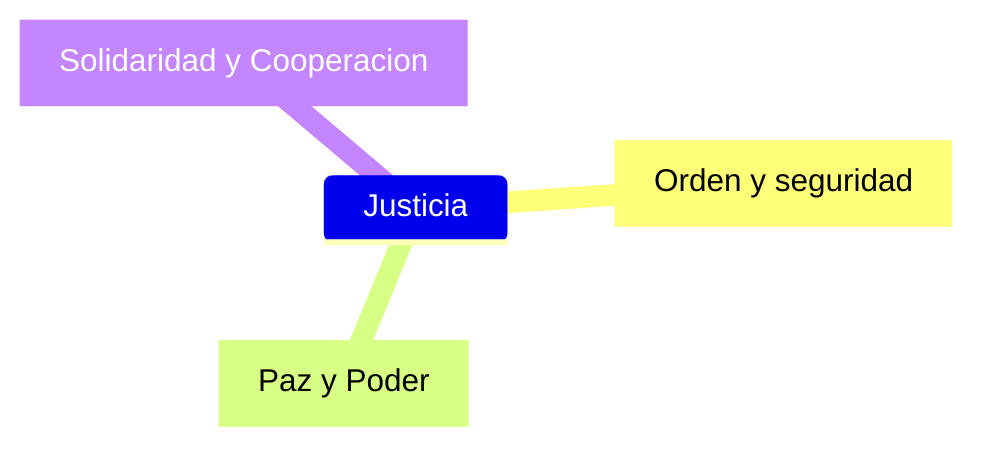
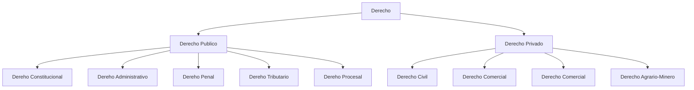

# Capitulo I

## Normas

1. **Regla** de conducta.
2. **Regla** que se debe seguir o a que se deben ajustar las conductas, tareas, actividades, etc.
3. **Regla** sobre la manera como se debe hacer o esta establecido que se haga una determinada cosa.
   * **Regla**:
      1. Aquello que ha de cumplirse por estar asi convenido por una colectividad.
      2. Estatuto, Constitucion o modo de ejecutar algo.
      3. Razon que debe servir de medida y a que se han de ajustar las acciones para que resulten rectas.
      4. "en regla": como es debido.

En resumen: **Una norma es la descripcion de una conducta (o la descripcion de una forma de actuar) que debe ser cumplida.**

A la hora de crear una norma se hace en base a 3 ejes: 

### Clasificacion

* Normas religiosas (impuestas por la fe de la persona).
* Normas morales (impuestas por su conciencia, fuero intimo)
* Normas sociales (impuestas por cada sociedad)
* Normas juridicas (impuestas por la sociedad):
  * Descripciones de comportamientos o formas de actuar, ordenados por el Estado
  * Son impuestas por la sociedad, por la forma de gobierno que tenemos, la sociedad lo hace por medio de autoridades constituidas por el Estado.
  * El incumplimiento de estas normas el estado mismo va a obligar a la sociedad a cumplir con esta norma o sancionar su incumplimiento.

### Caracteres de la Norma Juridica

* Regulacion de la relacion entre los hombres
* Exterioridad (actua sobre los actos)
* **Imperatividad** (imposicion de la regla de conducta)
* **Generalidad** (igual para todos)
* **Coercibilidad** (amenaza de sancion para el caso de incumplimiento)
* **Coactividad** (aplicacion de la fuerza del estado para exigir su cumplimiento)
* **Evolutivo** (que va cambiando/evolucionando?)

#### Coercibilidad vs Coactividad

La Coercibilidad es la amenaza de cierta sancion, por decirlo de una manera todos estamos de alguna forma amenazados a cumplir las normas porque sabemos que podemos ser sancionados.

La coactividad hace referencia al acto de la sancion, por ejemplo meternos en cana por incumplir una ley.

## Derecho

No hay una definicion en concreto pero: *"Conjunto de normas de conducta humana establecido por el Estado con caracter obligatorio y conforme a la justicia"*

### Derecho Objetivo y Derecho Subjetivo

- Desde el punto de vista objetivo es el conjunto de normas juridicas
- Desde el punto de vista subjetivo: es el conjunto de relaciones juridicas. Siendo relacion juridca el vinculo entre un acreedor y un deudor, donde el acreedor posee la facultad de exigir y el deudor el deber juridico de cumplir.

#### Clasificacion del Derecho

Son clasificaciones pero el derecho es uno solo, es un todo. Solo son formas de clasificarlo.

##### Derecho Publico - Derecho Privado

- Derecho Publico: Conjunto de normas que regulan el interes general del conjunto social.
- Derecho Privado **(IMPORTANTE ⚠️)**: Conjunto de normas que regulan el interes de cada persona en particular entre si.

##### Derecho Natural - Derecho Positivo

- Derecho natural: es el derecho universal e inmutable. Derecho del Hombre por ser Hombre.
- Derecho Positivo: es el conjunto de normas juridicas vigentes en un tiempo y lugar historico.

### Ramas del derecho (IMPORTANTE ⚠️)

### Fuentes del Derecho

Hace referencia a los modos en los que se crea o establece una norma juridica.

Se clasifican en dos categorias: 
- Fuentes Materiales
- **Fuentes Formales**

#### Fuentes Formales

Medios por los que se manifiesta la voluntad social dispuestos a crear derecho.

A su vez esta fuente del derecho se puede subclasificar en las siguientes:

* Ley:
    * **Tiene caracter vinculante.**
    * Prox capitulo.
* La Doctrina:
    * Es el producto de la actividad cientifica de los juristas
    * **No tiene caracter vinculante.** Pero tiene su influencia en la decicion de los jueces y abogados.
      * Su fuerza radica en el nivel academico y el prestigio del o los juristas que la crearon.
    * Sirve como herramienta auxiliar para entender las normas juridicas.
* La Jurisprudencia:
    * Es el conjunto de setencias concordantes sobre un mismo tema.
    * Cada sentencia se considera una norma en si. Dado un caso especifico se da una sentencia especifica.
      * Esta norma solo aplica para las partes intervinientes en el conflicto.
    * **No es vinculante** porque los jueces no estan obligados a considerar una de estas sentencias para el caso que este resolviendo y ademas puede ser aplicada pero con una interpretacion distinta segun quien lo interpreta.
      * Fallo plenario: esuna situacion que se da cuando dado dos casos similares tienen resoluciones opuestas.
        * Ante esta situacion se juntan todas las camaras de apelacion y se vota una unica resolucion.
          * **Esta resolucion se convierte en vinculante**
    * Instancias:
        1. Juzgado Nacional
        2. Camara Nacional de Apelaciones
        3. Excepcional. Recurso extraordinario. Corte Suprema de Justicia de la Nacion.
* Usos y Costumbres: **(IMPORTANTE ⚠️)**
    * Es la forma espontanea de la creacion del derecho
    * Surge de la conducta **repetida**, **habitual** y considerada **obligatoria**.
    * **¿Cuando es vinculante?** Se aplica en los casos donde no hay una ley que regle esto o cuando hay una ley que remite a esta costumbre (pero no esta aclarado).
    * Elementos necesarios de la costumbre:
      1. Debe ser nacida de la practica social repetida o habitual, sostenida en el tiempo.
      2. Debe ser considerada obligatoria por la sociedad.